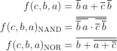
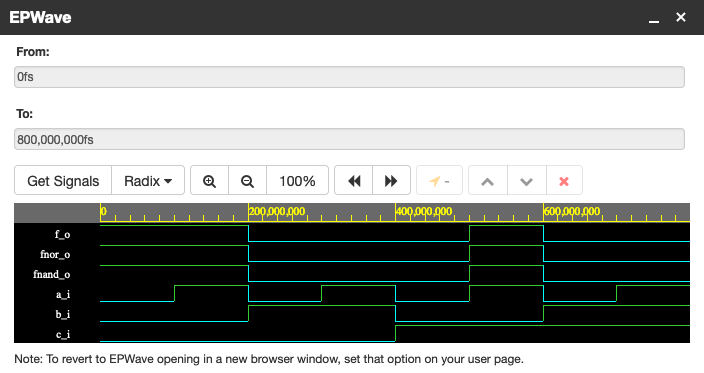
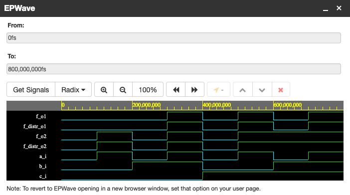

# Lab 1 assignment

You can find my DE-1 repository [here](https://github.com/xshele01/Digital-electronics-1).

## 1. Verification of De Morgan's laws of function f(c,b,a)

My public EDA Playground example can be found [here](https://www.edaplayground.com/x/Z5Sb).

Using De Morgan's laws I modified the following logic function to the form with NAND and NOR gates only:

<center>  </center>

My VHDL code from `design.vhd`:

```vhdl
library ieee;                -- Standard library
use ieee.std_logic_1164.all; -- Package for data types and logic operations

------------------------------------------------------------------------
-- Entity declaration for basic gates
------------------------------------------------------------------------
entity gates is

    port(
        a_i     : in  std_logic;        -- Data input
        b_i     : in  std_logic;        -- Data input
        c_i     : in  std_logic;        -- Data input
        f_o     : out std_logic;        -- output function
        fnand_o : out std_logic;        -- NAND output function
        fnor_o  : out std_logic         -- NOR output function
    );
    
end entity gates;

------------------------------------------------------------------------
-- Architecture body for basic gates
------------------------------------------------------------------------
architecture dataflow of gates is

begin
    f_o <= (not b_i and a_i) or (not c_i and not b_i);
    fnand_o <= not(not(not b_i and a_i) and not(not c_i and not b_i));
    fnor_o <= not(b_i or not(a_i or not c_i));
    
end architecture dataflow;
```

Screenshot with simulated time waveforms:

<center>  </center>

You can see the results in the folowing table:

<center>

| **c** | **b** |**a** | **f(c,b,a)** |
| :-: | :-: | :-: | :-: |
| 0 | 0 | 0 | 1 |
| 0 | 0 | 1 | 1 |
| 0 | 1 | 0 | 0 |
| 0 | 1 | 1 | 0 |
| 1 | 0 | 0 | 0 |
| 1 | 0 | 1 | 1 |
| 1 | 1 | 0 | 0 |
| 1 | 1 | 1 | 0 |

</center>

## 2. Verification of Distributive laws

My public EDA Playground example can be found [here](https://www.edaplayground.com/x/AKjK).

In EDA Playground, I verified Distributive laws:

<center>  </center>

My VHDL code from `design.vhd`:

```vhdl
library ieee;                -- Standard library
use ieee.std_logic_1164.all; -- Package for data types and logic operations

------------------------------------------------------------------------
-- Entity declaration for basic gates
------------------------------------------------------------------------
entity gates is

    port(
        a_i    	   : in  std_logic;     -- Data input
        b_i        : in  std_logic;     -- Data input
        c_i        : in  std_logic;     -- Data input
        f_o1       : out std_logic;    	-- 1st output function
        f_o2   	   : out std_logic;    	-- 2nd output function
        f_distr_o1 : out std_logic;    	-- 1st Distributive law output function
        f_distr_o2 : out std_logic		-- 2nd Distributive law output function
    );
    
end entity gates;

------------------------------------------------------------------------
-- Architecture body for basic gates
------------------------------------------------------------------------
architecture dataflow of gates is

begin
    f_o1 <= (a_i and b_i) or (a_i and c_i);
    f_o2 <= (a_i or b_i) and (a_i or c_i);
    f_distr_o1 <= a_i and (b_i or c_i);
    f_distr_o2 <= a_i or (b_i and c_i);
    
end architecture dataflow;
```

Screenshot with simulated time waveforms:

<center>  </center>