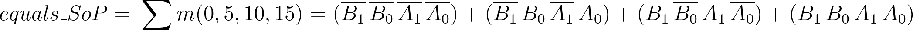
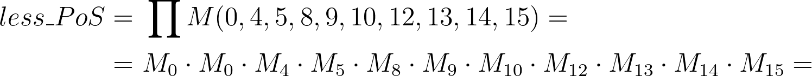
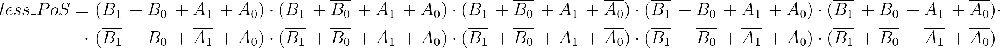

# Lab 2 Preparation

## Truth table

*Digital* or *Binary comparator* compares the digital signals A, B presented at input terminal and produce outputs depending upon the condition of those inputs.

*Magnitude comparator* is a combinational circuit that compares two numbers, A and B, and determines their relative magnitudes. The outcome of comparison is specifed by three binary variables that indicate whether *B > A* or *B < A*.

Truth table for 2-bit *Identity comparator* (B equals A), and two *Magnitude comparators*:

| **Decimal equivalent** | **B[1:0]** | **A[1:0]** | **B > A** | **B = A** | **B < A** |
| :-: | :-: | :-: | :-: | :-: | :-: |
| 0 | 0 0 | 0 0 | 0 | 1 | 0 |
| 1 | 0 0 | 0 1 | 0 | 0 | 1 |
| 2 | 0 0 | 1 0 | 0 | 0 | 1 |
| 3 | 0 0 | 1 1 | 0 | 0 | 1 |
| 4 | 0 1 | 0 0 | 1 | 0 | 0 |
| 5 | 0 1 | 0 1 | 0 | 1 | 0 |
| 6 | 0 1 | 1 0 | 0 | 0 | 1 |
| 7 | 0 1 | 1 1 | 0 | 0 | 1 |
| 8 | 1 0 | 0 0 | 1 | 0 | 0 |
| 9 | 1 0 | 0 1 | 1 | 0 | 0 |
| 10 | 1 0 | 1 0 | 0 | 1 | 0 |
| 11 | 1 0 | 1 1 | 0 | 0 | 1 |
| 12 | 1 1 | 0 0 | 1 | 0 | 0 |
| 13 | 1 1 | 0 1 | 1 | 0 | 0 |
| 14 | 1 1 | 1 0 | 1 | 0 | 0 |
| 15 | 1 1 | 1 1 | 0 | 1 | 0 |

## Canonical SoP and PoS forms for "equals" and "less than" functions

A logic function can be uniquely described by its truth table, or in one of the Boolean expression canonical forms: **Sum of the Products** (SoP) or **Product of the Sums** (PoS). The canonical SoP form is obtained from its truth table by taking the sum (OR) of the minterm of the rows where a 1 appears in the output.

A **minterm** is a product (AND) term containing all input variables of the function in either true or complemented form. A variable appears in complemented form if it is a 0 in the column of the truth-table, and as a true form if it appears as a 1.

The function *B = A* has a value of 1 in rows 0, 5, 10, 15. The sum of minterms form (canonical SoP) for function *B < A* is as follows:

 

The canonical product of the sums form is obtained from its truth table by taking the product (AND) of the Maxterms of the rows where a 0 appears in the output.

A **Maxterm** is a sum (OR) term containing all input variables of the function in either true or complemented form. A variable appears in complemented form if it is a 1 in the column of the truth-table, and as a true form if it appears as a 0.

The function *B < A* has a value of 0 in rows 0, 4, 5, 8, 9, 10, 12, 13, 14, 15. The product of Maxterms form (canonical PoS) for function A > B is as follows:

 

A more transparent notation contains only the Maxterms and their logical product:

 

