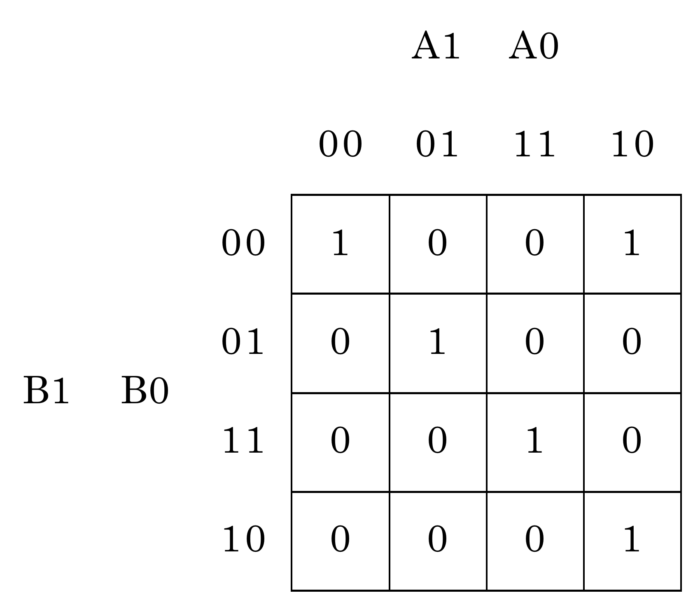

# Lab 2: Combinational logic

## 1. Truth table

Truth table for 2-bit *Identity comparator* (B equals A), and two *Magnitude comparators* (B greater than A and B less than A):

| **Decimal equivalent** | **B[1:0]** | **A[1:0]** | **B > A** | **B = A** | **B < A** |
| :-: | :-: | :-: | :-: | :-: | :-: |
| 0 | 0 0 | 0 0 | 0 | 1 | 0 |
| 1 | 0 0 | 0 1 | 0 | 0 | 1 |
| 2 | 0 0 | 1 0 | 0 | 0 | 1 |
| 3 | 0 0 | 1 1 | 0 | 0 | 1 |
| 4 | 0 1 | 0 0 | 1 | 0 | 0 |
| 5 | 0 1 | 0 1 | 0 | 1 | 0 |
| 6 | 0 1 | 1 0 | 0 | 0 | 1 |
| 7 | 0 1 | 1 1 | 0 | 0 | 1 |
| 8 | 1 0 | 0 0 | 1 | 0 | 0 |
| 9 | 1 0 | 0 1 | 1 | 0 | 0 |
| 10 | 1 0 | 1 0 | 0 | 1 | 0 |
| 11 | 1 0 | 1 1 | 0 | 0 | 1 |
| 12 | 1 1 | 0 0 | 1 | 0 | 0 |
| 13 | 1 1 | 0 1 | 1 | 0 | 0 |
| 14 | 1 1 | 1 0 | 1 | 0 | 0 |
| 15 | 1 1 | 1 1 | 0 | 1 | 0 |

The function *B = A* has a value of 1 in rows 0, 5, 10, 15. The sum of minterms form (canonical SoP) for function *B = A* is as follows:

 

The function *B < A* has a value of 0 in rows 0, 4, 5, 8, 9, 10, 12, 13, 14, 15. The product of Maxterms form (canonical PoS) for function *B < A* is as follows:

 

 

## 2. 2-bit comparator

The K-map for the "equals" function is as follows:



The K-map for the "less than" function is as follows:


The K-map for the "greater than" function is as follows:


K-maps offer a graphical method of simplification of SoP form of the "greater than" function and PoS form of the "less than" function:


Architecture of a 2-bit binary comparator can be defined in VHDL using conditional signal assignments `when` and `else`. Testbench can be written to verify the correct functionality of the comparator for all input combinations. 

Link to my public EDA Playground example:

https://www.edaplayground.com/x/eVBr

## 3. 4-bit binary comparator

Link to my public EDA Playground example:

https://www.edaplayground.com/x/9BDE

Listing of VHDL architecture from design file `design.vhd`:

```vhdl
------------------------------------------------------------------------
-- Architecture body for 4-bit binary comparator
------------------------------------------------------------------------
architecture Behavioral of comparator_4bit is
begin
    B_greater_A_o 	<= '1' when (b_i > a_i) else '0';
    B_equals_A_o 	<= '1' when (b_i = a_i) else '0';
    B_less_A_o 		<= '1' when (b_i < a_i) else '0';

end architecture Behavioral;
```

Listing of VHDL stimulus process from testbench file `testbench.vhd`:

```vhdl
--------------------------------------------------------------------
-- Data generation process
--------------------------------------------------------------------
p_stimulus : process
begin
    -- Report a note at the begining of stimulus process
    report "Stimulus process started" severity note;


    -- 0
    s_b <= "0000"; s_a <= "0000"; wait for 100 ns;
    -- Expected output
    assert ((s_B_greater_A = '0') and (s_B_equals_A = '1') and (s_B_less_A = '0'))
    -- If false, then report an error
    report "Test failed for input combination: 0000, 0000" severity error;


    -- 1
    s_b <= "0000"; s_a <= "0001"; wait for 100 ns;
    -- Expected output
    assert ((s_B_greater_A = '0') and (s_B_equals_A = '0') and (s_B_less_A = '1'))
    -- If false, then report an error
    report "Test failed for input combination: 0000, 0001" severity error;
    
    
    -- 2
    s_b <= "0000"; s_a <= "0010"; wait for 100 ns;
    -- Expected output
    assert ((s_B_greater_A = '0') and (s_B_equals_A = '0') and (s_B_less_A = '1'))
    -- If false, then report an error
    report "Test failed for input combination: 0000, 0010" severity error;
    
    
    -- 3
    s_b <= "0000"; s_a <= "0011"; wait for 100 ns;
    -- Expected output
    assert ((s_B_greater_A = '0') and (s_B_equals_A = '0') and (s_B_less_A = '1'))
    -- If false, then report an error
    report "Test failed for input combination: 0000, 0011" severity error;
    
    
    -- 16
    s_b <= "0001"; s_a <= "0000"; wait for 100 ns;
    -- Expected output
    assert ((s_B_greater_A = '1') and (s_B_equals_A = '0') and (s_B_less_A = '0'))
    -- If false, then report an error
    report "Test failed for input combination: 0001, 0000" severity error;
    
    
    -- 17
    s_b <= "0001"; s_a <= "0001"; wait for 100 ns;
    -- Expected output
    assert ((s_B_greater_A = '0') and (s_B_equals_A = '1') and (s_B_less_A = '0'))
    -- If false, then report an error
    report "Test failed for input combination: 0001, 0001" severity error;
    
    -- 18
    s_b <= "0001"; s_a <= "0010"; wait for 100 ns;
    -- Expected output
    assert ((s_B_greater_A = '0') and (s_B_equals_A = '0') and (s_B_less_A = '1'))
    -- If false, then report an error
    report "Test failed for input combination: 0001, 0010" severity error;
    
    -- 19
    s_b <= "0001"; s_a <= "0011"; wait for 100 ns;
    -- Expected output
    assert ((s_B_greater_A = '0') and (s_B_equals_A = '0') and (s_B_less_A = '1'))
    -- If false, then report an error
    report "Test failed for input combination: 0001, 0011" severity error;
    
    
    -- 32
    s_b <= "0010"; s_a <= "0000"; wait for 100 ns;
    -- Expected output
    assert ((s_B_greater_A = '1') and (s_B_equals_A = '0') and (s_B_less_A = '0'))
    -- If false, then report an error
    report "Test failed for input combination: 0010, 0000" severity error;
    
    
    -- 33
    s_b <= "0010"; s_a <= "0001"; wait for 100 ns;
    -- Expected output
    assert ((s_B_greater_A = '1') and (s_B_equals_A = '0') and (s_B_less_A = '0'))
    -- If false, then report an error
    report "Test failed for input combination: 0010, 0001" severity error;
    
    
    -- 34
    s_b <= "0010"; s_a <= "0010"; wait for 100 ns;
    -- Expected output
    assert ((s_B_greater_A = '0') and (s_B_equals_A = '1') and (s_B_less_A = '0'))
    -- If false, then report an error
    report "Test failed for input combination: 0010, 0010" severity error;
    
    
    -- 35
    s_b <= "0010"; s_a <= "0011"; wait for 100 ns;
    -- Expected output
    assert ((s_B_greater_A = '0') and (s_B_equals_A = '0') and (s_B_less_A = '1'))
    -- If false, then report an error
    report "Test failed for input combination: 0010, 0011" severity error;
    
    
    -- 48
    s_b <= "0011"; s_a <= "0000"; wait for 100 ns;
    -- Expected output
    assert ((s_B_greater_A = '1') and (s_B_equals_A = '0') and (s_B_less_A = '0'))
    -- If false, then report an error
    report "Test failed for input combination: 0011, 0000" severity error;
    
    
    -- 49
    s_b <= "0011"; s_a <= "0001"; wait for 100 ns;
    -- Expected output
    assert ((s_B_greater_A = '1') and (s_B_equals_A = '0') and (s_B_less_A = '0'))
    -- If false, then report an error
    report "Test failed for input combination: 0011, 0001" severity error;
    
    
    -- 50
    s_b <= "0011"; s_a <= "0010"; wait for 100 ns;
    -- Expected output
    assert ((s_B_greater_A = '1') and (s_B_equals_A = '0') and (s_B_less_A = '0'))
    -- If false, then report an error
    report "Test failed for input combination: 0011, 0010" severity error;
    
    
    -- 51
    s_b <= "0011"; s_a <= "0011"; wait for 100 ns;
    -- Expected output
    assert ((s_B_greater_A = '0') and (s_B_equals_A = '1') and (s_B_less_A = '0'))
    -- If false, then report an error
    report "Test failed for input combination: 0011, 0011" severity error;

    -- Report a note at the end of stimulus process
    report "Stimulus process finished" severity note;
    wait;
end process p_stimulus;
```

After changing assertion for input combination `0011, 0010` from

```vhdl
s_B_greater_A = '1'
```

to

```vhdl
s_B_greater_A = '0'
```

Simulator console output reports one error:

```
analyze design.vhd
analyze testbench.vhd
elaborate tb_comparator_4bit
testbench.vhd:47:9:@0ms:(report note): Stimulus process started
testbench.vhd:163:9:@1500ns:(assertion error): Test failed for input combination: 0011, 0010
testbench.vhd:176:9:@1600ns:(report note): Stimulus process finished
Finding VCD file...
./dump.vcd
```

