# Lab 3: Introduction to Vivado

## 1. Preparation tasks

<a href="https://reference.digilentinc.com/reference/programmable-logic/nexys-a7/reference-manual#basic_io" target="_blank">Reference manual on LEDs</a>

The *Nexys A7* board provides sixteen switches and LEDs. The switches can be used to provide inputs, and the LEDs can be used as output devices.

The sixteen individual high-efficiency LEDs are anode-connected to the FPGA via 330-ohm resistors, so they will turn on when a logic *high voltage* is applied to their respective I/O pin. Connection table:
| **LED number** | **FPGA pin** |
| :-: | :-: |
| LD0 | H17 |
| LD1 | K15 |
| LD2 | J13 |
| LD3 | N14 |
| LD4 | R18 |
| LD5 | V17 |
| LD6 | U17 |
| LD7 | U16 |
| LD8 | V16 |
| LD9 | T15 |
| LD10 | U14 |
| LD11 | T16 |
| LD12 | V15 |
| LD13 | V14 |
| LD14 | V12 |
| LD15 | V11 |


Slide switches are connected to the FPGA via series resistors to prevent damage from inadvertent short circuits. Slide switches generate constant high or low inputs depending on their position. Connection table:

| **LED number** | **FPGA pin** |
| :-: | :-: |
| SW0 | J15 |
| SW1 | L16 |
| SW2 | M13 |
| SW3 | R15 |
| SW4 | R17 |
| SW5 | T18 |
| SW6 | U18 |
| SW7 | R13 |
| SW8 | T8 |
| SW9 | U8 |
| SW10 | R16 |
| SW11 | T13 |
| SW12 | H6 |
| SW13 | U12 |
| SW14 | U11 |
| SW15 | V10 |

## 2. 2-bit wide 4-to-1 multiplexer

A *multiplexer* (MUX) is a device that has multiple inputs and a single line output. It implements the following truth table:

| **Select sel_i[1:0]** | **Output f_o[1:0]** |
| :-: | :-: |
| 0 0 | a_i[1:0] |
| 0 1 | b_i[1:0] |
| 1 0 | c_i[1:0] |
| 1 1 | d_i[1:0] |

VHDL architecture from source file ```mux_2bit_4to1.vhd```:

```vhdl
------------------------------------------------------------------------
-- Architecture body for mux_2bit_4to1
------------------------------------------------------------------------
architecture behavioral of mux_2bit_4to1 is

begin
    f_o <=  a_i when (sel_i = "00") else 
            b_i when (sel_i = "01") else 
            c_i when (sel_i = "10") else 
            d_i;
 
end architecture behavioral;
```

VHDL stimulus process from testbench file ```tb_mux_2bit_4to1.vhd```:

```vhdl
--------------------------------------------------------------------
    -- Data generation process
    --------------------------------------------------------------------
    p_stimulus : process
    begin
        -- Report a note at the begining of stimulus process
        report "Stimulus process started" severity note;
        
        -- 1st test
        s_a <= "00"; s_b <= "01"; s_c <= "10"; s_d <= "11"; 
        s_sel <= "00"; wait for 62.5 ns;
        s_sel <= "01"; wait for 62.5 ns;
        s_sel <= "10"; wait for 62.5 ns;
        s_sel <= "11"; wait for 62.5 ns;

        -- 2nd test
        s_a <= "01"; s_b <= "10"; s_c <= "11"; s_d <= "00"; 
        s_sel <= "00"; wait for 62.5 ns;
        s_sel <= "01"; wait for 62.5 ns;
        s_sel <= "10"; wait for 62.5 ns;
        s_sel <= "11"; wait for 62.5 ns;
        
        -- 3rd test
        s_a <= "10"; s_b <= "11"; s_c <= "00"; s_d <= "01"; 
        s_sel <= "00"; wait for 62.5 ns;
        s_sel <= "01"; wait for 62.5 ns;
        s_sel <= "10"; wait for 62.5 ns;
        s_sel <= "11"; wait for 62.5 ns;
        
        -- 4th test
        s_a <= "11"; s_b <= "00"; s_c <= "01"; s_d <= "10"; 
        s_sel <= "00"; wait for 62.5 ns;
        s_sel <= "01"; wait for 62.5 ns;
        s_sel <= "10"; wait for 62.5 ns;
        s_sel <= "11"; wait for 62.5 ns;
            
        -- Report a note at the end of stimulus process
        report "Stimulus process finished" severity note;
        wait;
    end process p_stimulus;
```

Screenshot with simulated time waveforms:

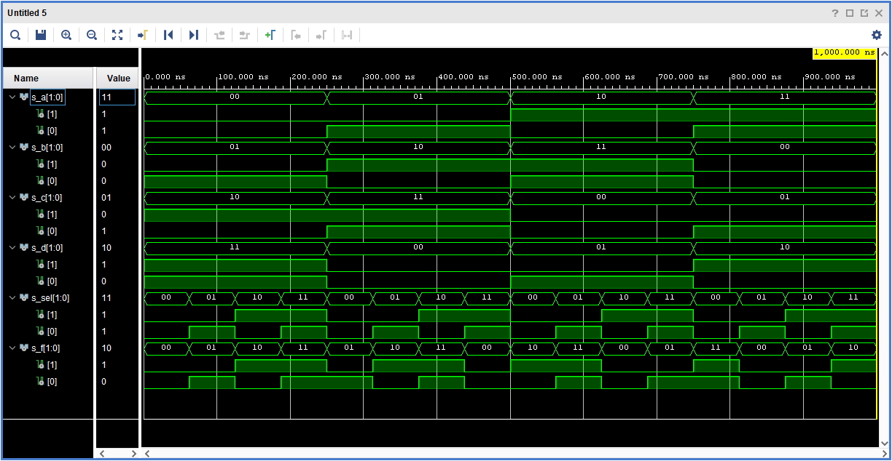

## 3. A Vivado tutorial

### Initial Project Creation

To create a new Vivado project, open up the Vivado application, click on the *“Create Project”* button and then click *“Next”* on the next screen.

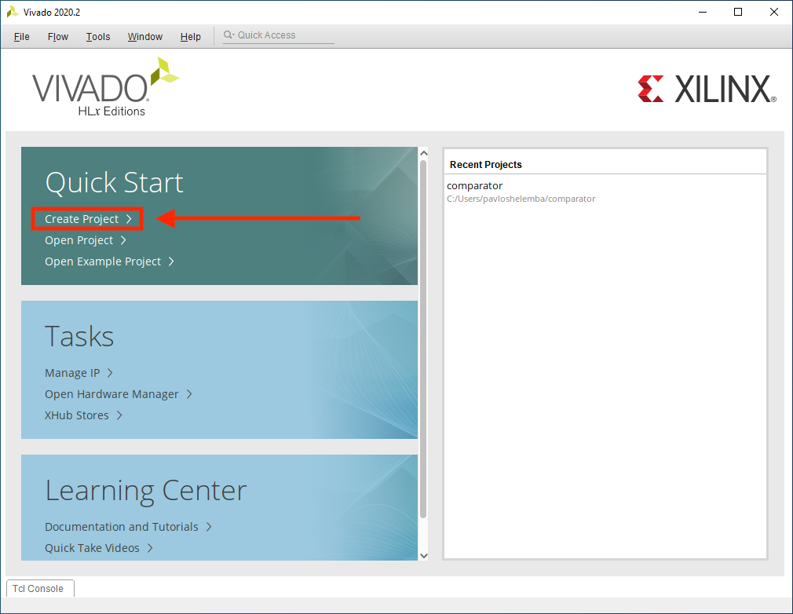

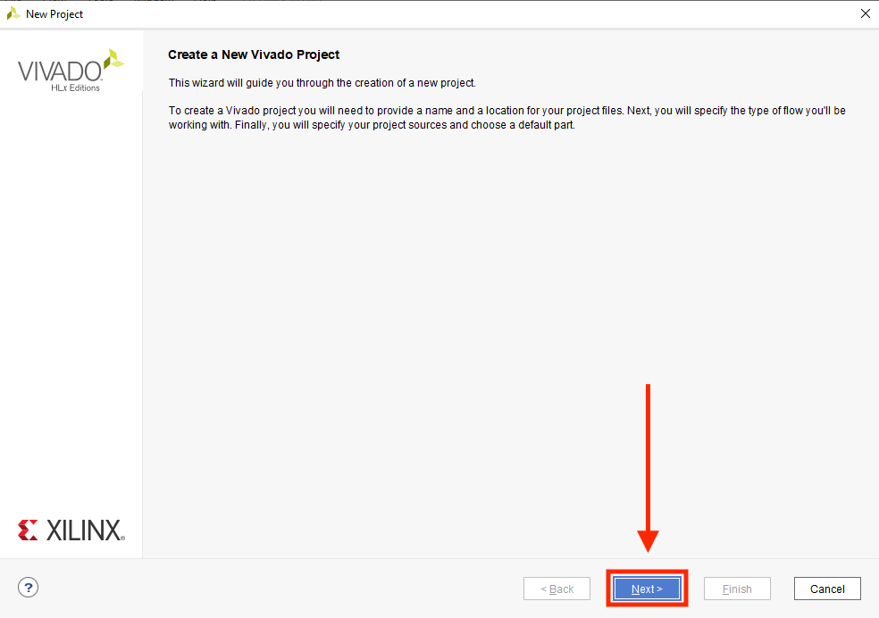

Name your project and choose where to save it. For *Digital electronics 1* course, choose location of a respective lab in your git repository. Name and file path must not have spaces in it! When finished, click *“Next”* and then choose RTL project (default option) on the next screen and click *“Next”* again.

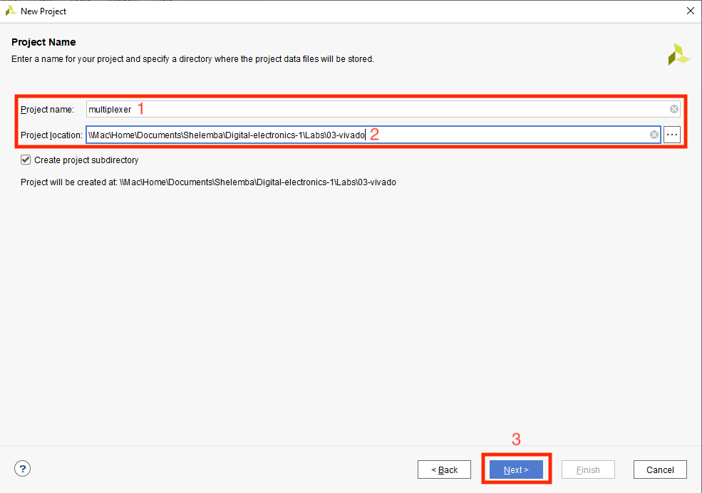

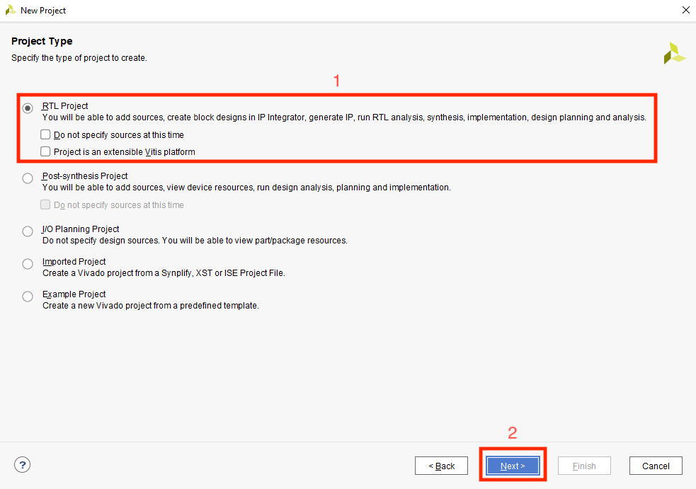

On *"Add Sources"* page, choose *“Create File”*. A *“Create Source File”* window will pop up where you can choose file type (VHDL) and the name of the file. Don't forget to set targer language and simulator language to VHDL before pressing that juicy *"Next"* button! 

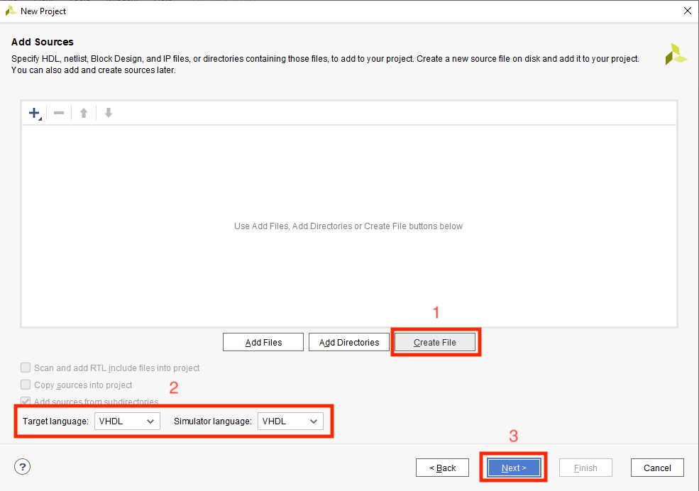

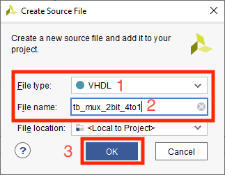

You can skip *"Add Constraints"* page for now. 
On the *"Default part"* page, select the FPGA you are using. Click on the *“Boards”* button and type in the board file for your respective board. Make sure your board files are in your Vivado installation folder: ```YOUR_VIVADO_LOCATION\2020.2\data\boards\board_files\```.

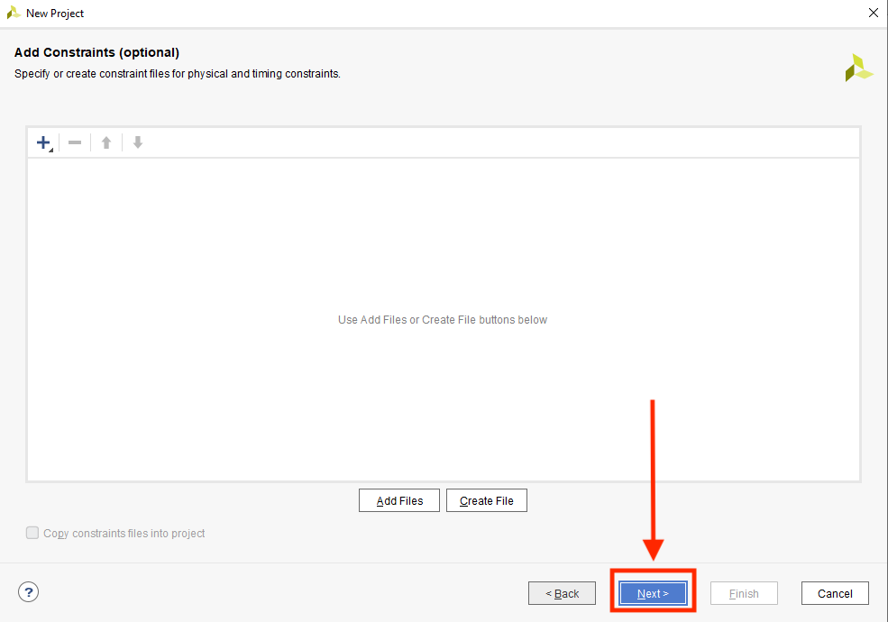

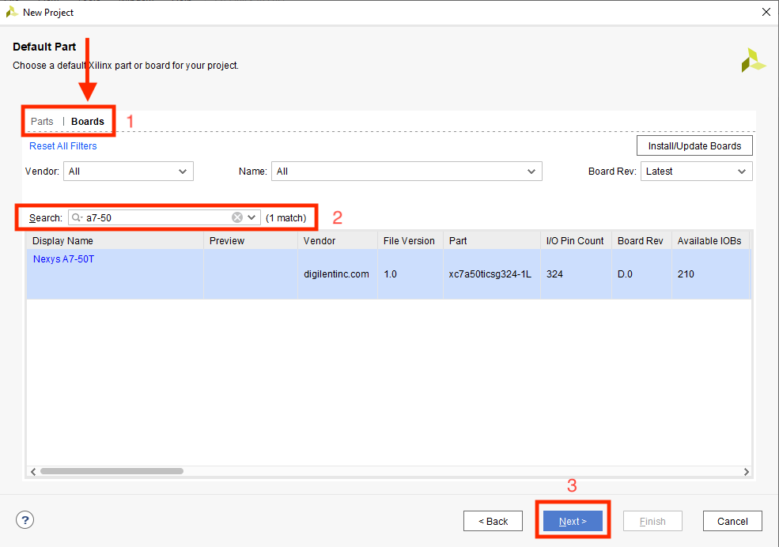

That's it! Confirm your choises and press *"Finish"*!

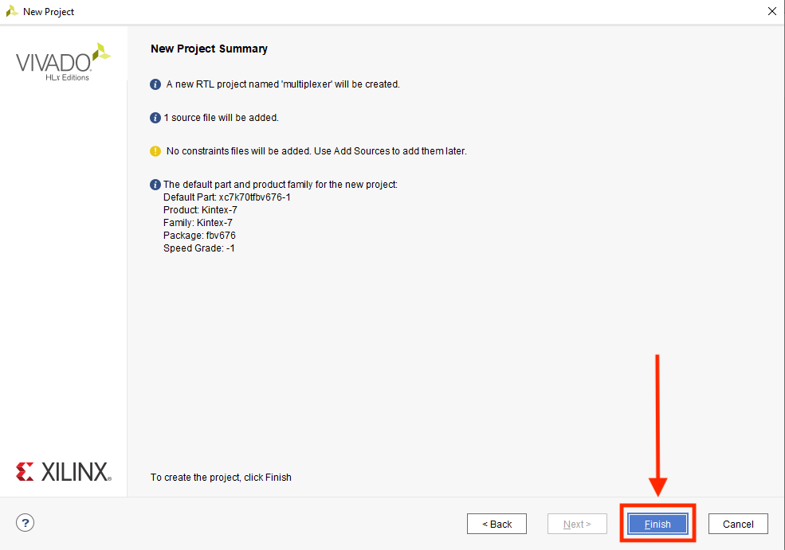

### Working in Vivado

After creating a ptoject, you will be asked to define a module. Make sure your entity name and VHDL source file name are the same! Vivado should name your files accordingly, so you can leave them as is and ignore the warning.

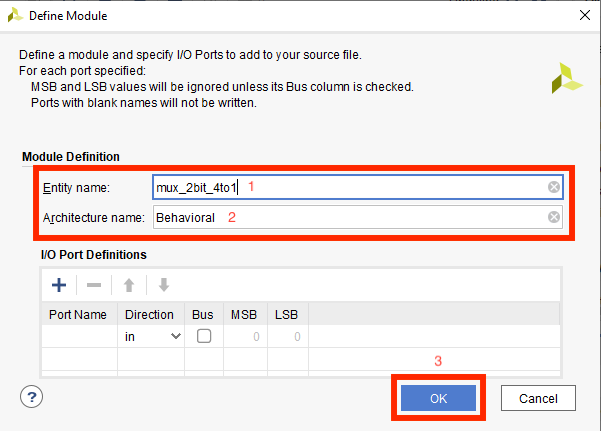

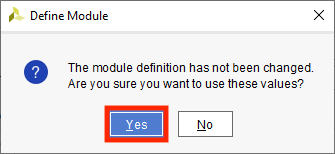

You can find your VHDL source file under *Design Sources* tab. It will open in the window to the right. 
You can create a testbench file by pressing a plus [**+**] incon or by choosing **File > Add Sources Alt+A > Add or create simulation sources** in the menu. Choose the third option and click *"Next"*. You will be asked to define the module, just as with the entity.

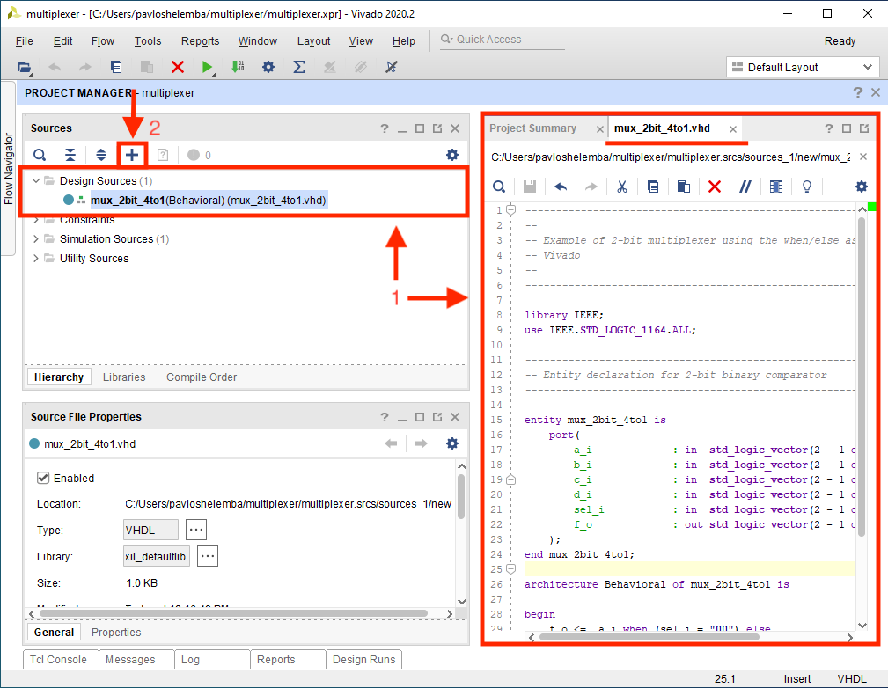

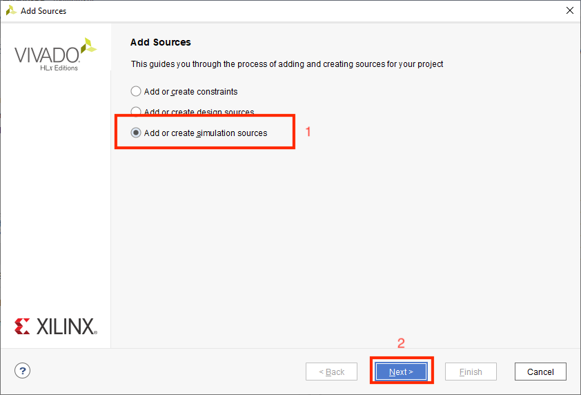

You can find your testbench file under *Simulation Sources* tab. It will open in the window to the right. 

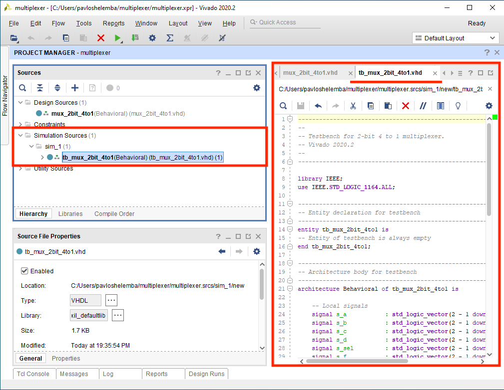

To run a Vivado simulator, use **Flow > Run Simulation > Run Behavioral Simulation** or use FlowNavigator to the left and choose *Run Simulation* under *SIMULATION* tab.
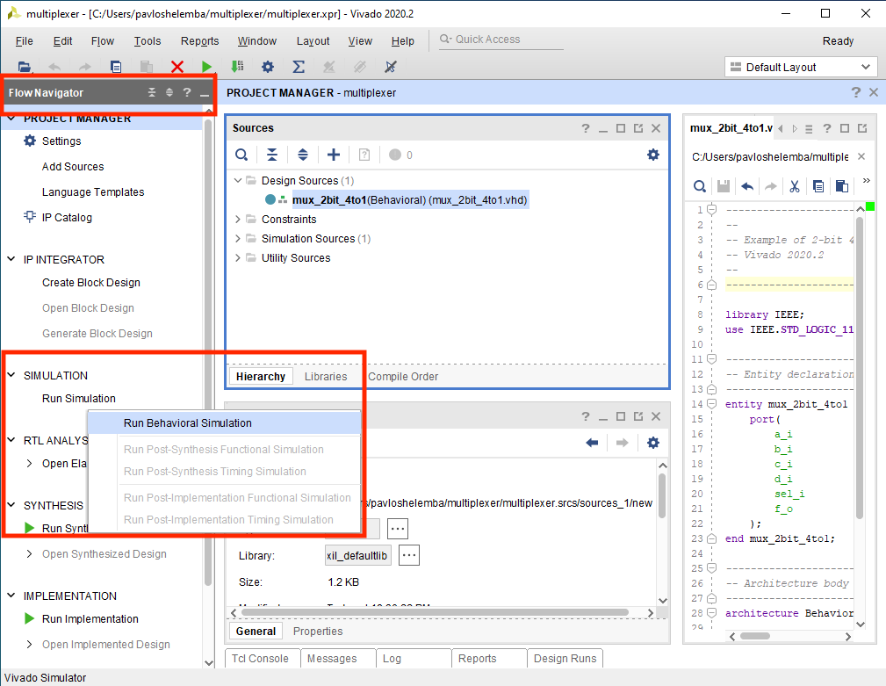