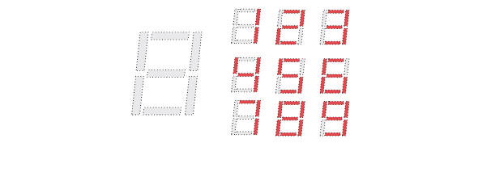
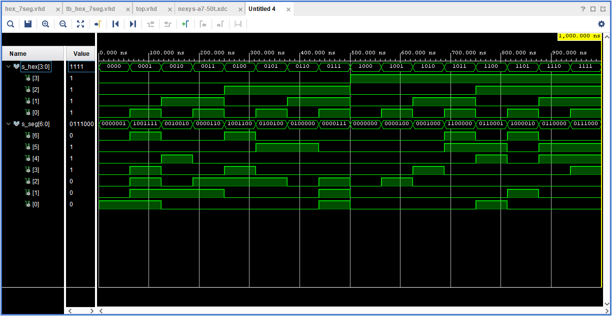
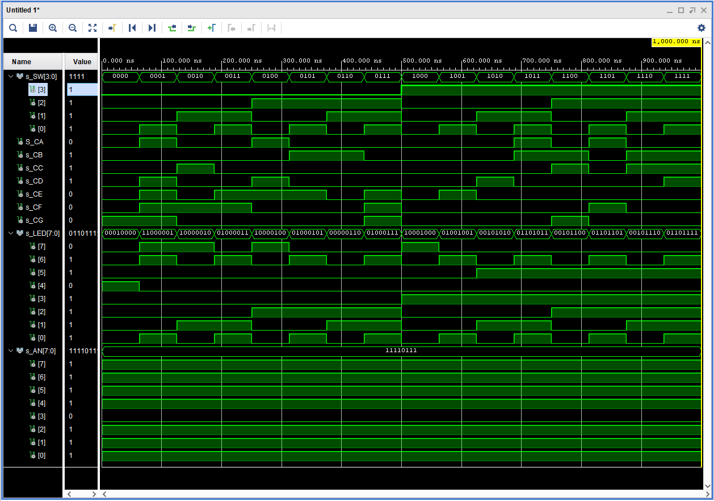
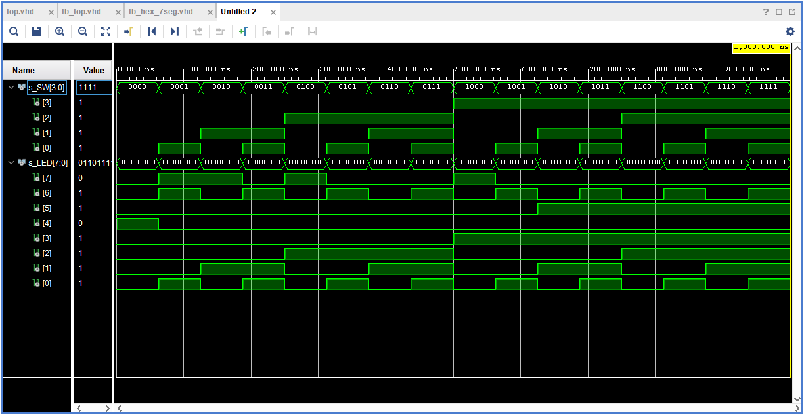

# Lab 4: Seven-segment display decoder

## 1. Preparation task

[Reference manual on Seven-Segment Display](https://reference.digilentinc.com/reference/programmable-logic/nexys-a7/reference-manual#seven-segment_display)

The Nexys A7 board contains two four-digit common anode seven-segment LED displays, configured to behave like a single eight-digit display. Each of the eight digits is composed of seven segments arranged in a “figure 8” pattern, with an LED embedded in each segment:



The anodes of the seven LEDs forming each digit are tied together into one “common anode” circuit node, but the LED cathodes remain separate:


The common anode signals are available as eight “digit enable” input signals to the 8-digit display. The cathodes of similar segments on all four displays are connected into seven circuit nodes labeled CA through CG:

<table>
<tr>
<td>

| **Cathode** | **FPGA pin** |
| :-: | :-: |
| CA | T10 |
| CB | R10 |
| CC | K16 |
| CD | K13 |
| CE | P15 |
| CF | T11 |
| CG | L18 |
| DP | H15 |

</td>
<td>

| **Anode** | **FPGA pin** |
| :-: | :-: |
| AN7 | U13 |
| AN6 | K2 |
| AN5 | T14 |
| AN4 | P14 |
| AN3 | J14 |
| AN2 | T9 |
| AN1 | J18 |
| AN0 | J17 |

</td>
</tr> 
</table>

These seven cathode signals are available as inputs to the 8-digit display. This signal connection scheme creates a multiplexed display, where the cathode signals are common to all digits but they can only illuminate the segments of the digit whose corresponding anode signal is asserted. 


Both the AN0..7 and the CA..G/DP signals are driven low when active. 

Decoder conversion table for common anode 7-segment display:

| **Hex** | **Inputs** | **A** | **B** | **C** | **D** | **E** | **F** | **G** |
| :-: | :-: | :-: | :-: | :-: | :-: | :-: | :-: | :-: |
| 0 | 0000 | 0 | 0 | 0 | 0 | 0 | 0 | 1 |
| 1 | 0001 | 1 | 0 | 0 | 1 | 1 | 1 | 1 |
| 2 | 0010 | 0 | 0 | 1 | 0 | 0 | 1 | 0 |
| 3 | 0011 | 0 | 0 | 0 | 0 | 1 | 1 | 0 |
| 4 | 0100 | 1 | 0 | 0 | 1 | 1 | 0 | 0 |
| 5 | 0101 | 0 | 1 | 0 | 0 | 1 | 0 | 0 |
| 6 | 0110 | 0 | 1 | 0 | 0 | 0 | 0 | 0 |
| 7 | 0111 | 0 | 0 | 0 | 0 | 1 | 1 | 1 |
| 8 | 1000 | 0 | 0 | 0 | 0 | 0 | 0 | 0 |
| 9 | 1001 | 0 | 0 | 0 | 0 | 1 | 0 | 0 |
| A | 1010 | 0 | 0 | 0 | 1 | 0 | 0 | 0 |
| b | 1011 | 1 | 1 | 0 | 0 | 0 | 0 | 0 |
| C | 1100 | 0 | 1 | 1 | 0 | 0 | 0 | 1 |
| d | 1101 | 1 | 0 | 0 | 0 | 0 | 1 | 0 |
| E | 1110 | 0 | 1 | 1 | 0 | 0 | 0 | 0 |
| F | 1111 | 0 | 1 | 1 | 1 | 0 | 0 | 0 |

## 2. Seven-segment display decoder

Listing of VHDL architecture from source file ```hex_7seg.vhd```:

```vhdl
begin

    --------------------------------------------------------------------
    -- p_7seg_decoder:
    -- A combinational process for 7-segment display decoder. 
    -- Any time "hex_i" is changed, the process is "executed".
    -- Output pin seg_o(6) corresponds to segment A, seg_o(5) to B, etc.
    --------------------------------------------------------------------
    p_7seg_decoder : process(hex_i)
    
    begin
    
        case hex_i is
            when "0000" =>
                seg_o <= "0000001";     -- 0
            when "0001" =>
                seg_o <= "1001111";     -- 1
            when "0010" =>
                seg_o <= "0010010";     -- 2
            when "0011" =>
                seg_o <= "0000110";     -- 3
            when "0100" =>
                seg_o <= "1001100";     -- 4
            when "0101" =>
                seg_o <= "0100100";     -- 5
            when "0110" =>
                seg_o <= "0100000";     -- 6
            when "0111" =>
                seg_o <= "0000111";     -- 7
            when "1000" =>
                seg_o <= "0000000";     -- 8
            when "1001" =>
                seg_o <= "0000100";     -- 9
            when "1010" =>
                seg_o <= "0001000";     -- A
            when "1011" =>
                seg_o <= "1100000";     -- b
            when "1100" =>
                seg_o <= "0110001";     -- C
            when "1101" =>
                seg_o <= "1000010";     -- d  
            when "1110" =>
                seg_o <= "0110000";     -- E
            when others =>
                seg_o <= "0111000";     -- F
        end case;
        
    end process p_7seg_decoder;
```

Listing of VHDL stimulus process from testbench file ```tb_hex_7seg.vhd```:

```vhdl
    p_stimulus : process
    begin
        -- Report a note at the begining of stimulus process
        report "Stimulus process started" severity note;
        
        -- 1st test
        s_hex <= "0000"; wait for 62.5 ns;
        -- 2nd test
        s_hex <= "0001"; wait for 62.5 ns;
        -- 3rd test
        s_hex <= "0010"; wait for 62.5 ns;
        -- 4th test
        s_hex <= "0011"; wait for 62.5 ns;
        -- 5th test
        s_hex <= "0100"; wait for 62.5 ns;
        -- 6th test
        s_hex <= "0101"; wait for 62.5 ns;
        -- 7th test
        s_hex <= "0110"; wait for 62.5 ns;
        -- 8th test
        s_hex <= "0111"; wait for 62.5 ns;
        -- 9th test
        s_hex <= "1000"; wait for 62.5 ns;
        -- 10th test
        s_hex <= "1001"; wait for 62.5 ns;
        -- 11th test
        s_hex <= "1010"; wait for 62.5 ns;
        -- 12th test
        s_hex <= "1011"; wait for 62.5 ns;
        -- 13th test
        s_hex <= "1100"; wait for 62.5 ns;
        -- 14th test
        s_hex <= "1101"; wait for 62.5 ns;
        -- 15th test
        s_hex <= "1110"; wait for 62.5 ns;
        -- 16th test
        s_hex <= "1111"; wait for 62.5 ns;
            
        -- Report a note at the end of stimulus process
        report "Stimulus process finished" severity note;
        wait;
    end process p_stimulus;
```

Screenshot with simulated time waveforms:



Listing of VHDL code from source file ```top.vhd``` with 7-segment module instantiation:

```vhdl
    --------------------------------------------------------------------
    -- Instance (copy) of hex_7seg entity
    --------------------------------------------------------------------
    hex2seg : entity work.hex_7seg
        port map(
            hex_i    => SW,
            
            seg_o(6) => CA,
            seg_o(5) => CB,
            seg_o(4) => CC,
            seg_o(3) => CD,
            seg_o(2) => CE,
            seg_o(1) => CF,
            seg_o(0) => CG
        );
```

## 3. LED(7:4) indicators

Truth table for LEDs:

| **Hex** | **Inputs** | **LED4** | **LED5** | **LED6** | **LED7** |
| :-: | :-: | :-: | :-: | :-: | :-: |
| 0 | 0000 | 1 | 0 | 0 | 0 |
| 1 | 0001 | 0 | 0 | 1 | 1 |
| 2 | 0010 | 0 | 0 | 0 | 1 |
| 3 | 0011 | 0 | 0 | 1 | 0 |
| 4 | 0100 | 0 | 0 | 0 | 1 |
| 5 | 0101 | 0 | 0 | 1 | 0 |
| 6 | 0110 | 0 | 0 | 0 | 0 |
| 7 | 0111 | 0 | 0 | 1 | 0 |
| 8 | 1000 | 0 | 0 | 0 | 1 |
| 9 | 1001 | 0 | 0 | 1 | 0 |
| A | 1010 | 0 | 1 | 0 | 0 |
| b | 1011 | 0 | 1 | 1 | 0 |
| C | 1100 | 0 | 1 | 0 | 0 |
| d | 1101 | 0 | 1 | 1 | 0 |
| E | 1110 | 0 | 1 | 0 | 0 |
| F | 1111 | 0 | 1 | 1 | 0 |

Listing of VHDL code for LEDs(7:4):

```vhdl
-- Turn LED(4) on if input value is equal to 0, ie "0000"
LED(4) <= '1' when SW = "0000" else '0';

-- Turn LED(5) on if input value is greater than 9
LED(5) <= '1' when SW > "1001" else '0';

-- Turn LED(6) on if input value is odd, ie 1, 3, 5, ...
LED(6) <=   '1' when SW = "0001" else
            '1' when SW = "0011" else 
            '1' when SW = "0101" else 
            '1' when SW = "0111" else 
            '1' when SW = "1001" else 
            '1' when SW = "1011" else 
            '1' when SW = "1101" else  
            '1' when SW = "1111" else 
            '0';

-- Turn LED(7) on if input value is a power of two, ie 1, 2, 4, or 8
LED(7) <=   '1' when SW = "0001" else
            '1' when SW = "0010" else 
            '1' when SW = "0100" else 
            '1' when SW = "1000" else 
            '0';
```

Screenshot with simulated time waveforms (all inputs and outputs of ```top.vhd```):



Screenshot with simulated time waveforms (only LEDs):

