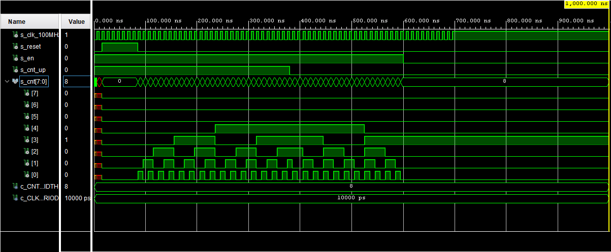
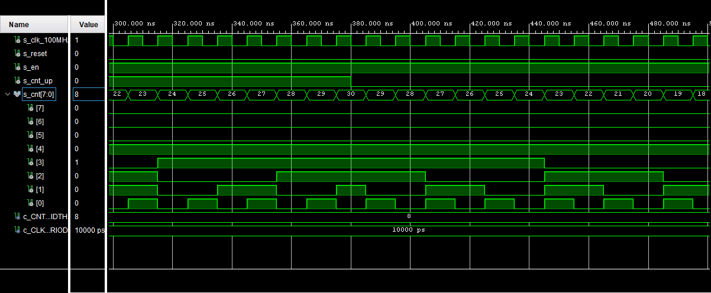
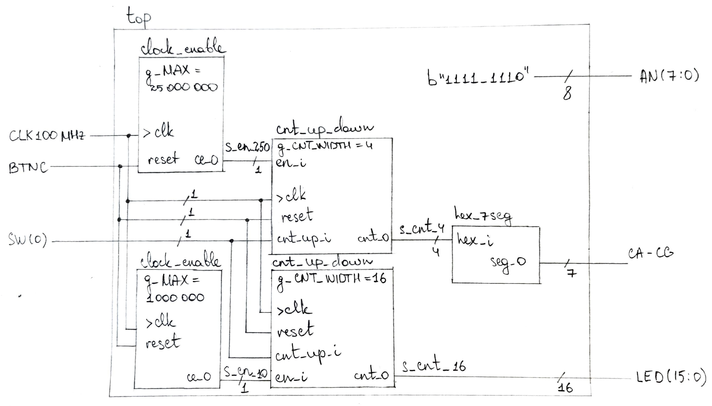

# Lab 5: Binary counter

## 1. Preparation task

The pushbuttons are connected to the FPGA via series resistors to prevent damage from inadvertent short circuits. 

The five pushbuttons arranged in a plus-sign configuration are “momentary” switches that normally generate a *low output when at rest*, and a *high output when pressed*.

The red pushbutton labeled ```CPU RESET```, on the other hand, generates a *high output when at rest* and a *low output when pressed*. The *CPU RESET* button is intended to be used in EDK designs to reset the processor, but you can also use it as a general purpose pushbutton.

Connection table:
| **Button** | **FPGA pin** |
| :-: | :-: |
| BTNL | P17 |
| BTNR | M17 |
| BTNU | M18 |
| BTND | P18 |
| BTNC | N17 |
| BTNRES| C12 |

Table with the number of periods of clock signal with frequency of 100 MHz in the span of 2 ms, 4 ms, 10 ms, 250 ms, 500 ms, and 1 s.
| **Time interval** | **Number of clk periods** | **Number of clk periods in hex** | **Number of clk periods in binary** |
| :-: | :-: | :-: | :-: |
| 2 ms | 200 000 | x"3_0d40" | b"0011_0000_1101_0100_0000" |
| 4 ms | 400 000 | x"6_1A80" | b"0110_0001_1010_1000_0000" |
| 10 ms | 1 000 000 | x"F_4240" | b"1111_0100_0010_0100_0000" |
| 250 ms | 25 000 000 | x"17D_7840" | b"0001_0111_1101_0111_1000_0100_0000" |
| 500 ms | 50 000 000 | x"2FA_F080" | b"0010_1111_1010_1111_0000_1000_0000" |
| 1 sec | 100 000 000 | x"5F5_E100" | b"0101_1111_0101_1110_0001_0000_0000" |

## 2. Bidirectional counter

Listing of VHDL code of the process ```p_cnt_up_down```:

```vhdl
p_cnt_up_down : process(clk)
begin
    if rising_edge(clk) then
    
        if (reset = '1') then               -- Synchronous reset
            s_cnt_local <= (others => '0'); -- Clear all bits

        elsif (en_i = '1') then             -- Test if counter is enabled
            
            -- Test direction
            if (cnt_up_i = '1') then        
            s_cnt_local <= s_cnt_local + 1;
            elsif (cnt_up_i = '0') then
            s_cnt_local <= s_cnt_local - 1;
            end if;

        end if;
    end if;
end process p_cnt_up_down;
```

Listing of VHDL reset and stimulus processes from testbench file ```tb_cnt_up_down.vhd```:

```vhdl
--------------------------------------------------------------------
-- Clock generation process
--------------------------------------------------------------------
p_clk_gen : process
begin
    while now < 1000 ns loop         -- 100 periods of 100MHz clock
        s_clk_100MHz <= '0';
        wait for c_CLK_100MHZ_PERIOD / 2;
        s_clk_100MHz <= '1';
        wait for c_CLK_100MHZ_PERIOD / 2;
    end loop;
    wait;
end process p_clk_gen;

--------------------------------------------------------------------
-- Reset generation process
--------------------------------------------------------------------
p_reset_gen : process
begin
    s_reset <= '0';
    wait for 15 ns;
    s_reset <= '1';                 -- Reset activated
    wait for 70 ns;
    s_reset <= '0';
    wait;
end process p_reset_gen;

--------------------------------------------------------------------
-- Data generation process
--------------------------------------------------------------------
p_stimulus : process
begin
    report "Stimulus process started" severity note;

    s_en     <= '1';                -- Enable counting
    s_cnt_up <= '1';
    wait for 380 ns;                -- Change counter direction
    s_cnt_up <= '0';
    wait for 220 ns;
    s_en     <= '0';                -- Disable counting

    report "Stimulus process finished" severity note;
    wait;
end process p_stimulus;
```

Screenshot with simulated time waveforms:



Screenshot with simulated time waveforms zoomed in at the point of direction change:



## 3. Top level

Listing of VHDL code from source file ```top.vhd``` with all instantiations for the 4-bit bidirectional counter:

```vhdl
--------------------------------------------------------------------
-- Instance (copy) of clock_enable entity
--------------------------------------------------------------------
clk_en0 : entity work.clock_enable
    generic map(
        g_MAX => 25000000        -- 250 ms
    )
    port map(
        clk => CLK100MHZ,
        reset => BTNC,
        ce_o => s_en
    );

--------------------------------------------------------------------
-- Instance (copy) of cnt_up_down entity
--------------------------------------------------------------------
bin_cnt0 : entity work.cnt_up_down
    generic map(
        g_CNT_WIDTH => 4        -- 4-bit counter
    )
    port map(
            clk => CLK100MHZ,
        reset => BTNC,
        en_i     => s_en,
        cnt_up_i => SW(0),
        cnt_o    => s_cnt
    );

-- Display input value on LEDs
LED(3 downto 0) <= s_cnt;

--------------------------------------------------------------------
-- Instance (copy) of hex_7seg entity
--------------------------------------------------------------------
hex2seg : entity work.hex_7seg
    port map(
        hex_i    => s_cnt,
        seg_o(6) => CA,
        seg_o(5) => CB,
        seg_o(4) => CC,
        seg_o(3) => CD,
        seg_o(2) => CE,
        seg_o(1) => CF,
        seg_o(0) => CG
    );

-- Connect one common anode to 3.3V
AN <= b"1111_1110";
```

Sketch of the top layer including both 4- and 16-bit bidirectional counters:



