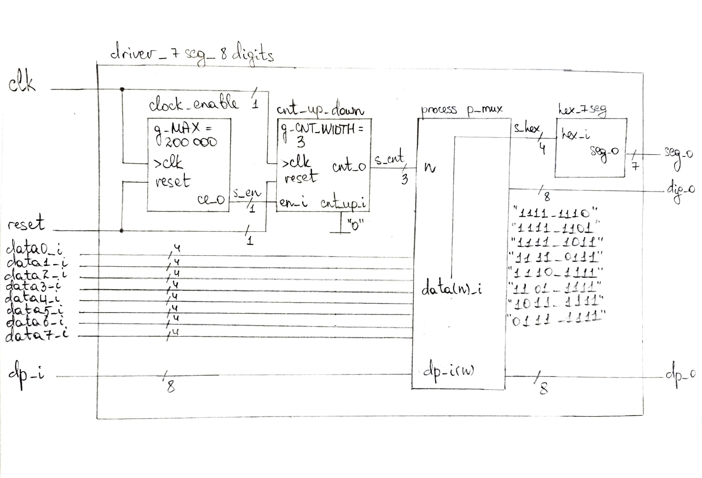

# Lab 6: Driver for multiple seven-segment displays

## 1. Preparation task

Timing diagram figure for displaying value ```3.142```:


## 2. Display driver

Listing of VHDL code of the process ```p_mux```:

```vhdl
p_mux : process(s_cnt, data0_i, data1_i, data2_i, data3_i, dp_i)
    begin
        case s_cnt is
            when "11" =>
                s_hex <= data3_i;
                dp_o  <= dp_i(3);   -- 0111
                dig_o <= "0111";

            when "10" =>
                s_hex <= data2_i;
                dp_o  <= dp_i(2);
                dig_o <= "1011";

            when "01" =>
                s_hex <= data1_i;
                dp_o  <= dp_i(1);
                dig_o <= "1101";

            when others =>
                s_hex <= data0_i;
                dp_o  <= dp_i(0);
                dig_o <= "1110";
        end case;
    end process p_mux;
```

Listing of VHDL testbench file ```tb_driver_7seg_4digits```:

```vhdl
------------------------------------------------------------------------
--
-- Template for 4-digit 7-segment display driver testbench.
-- Nexys A7-50T, Vivado v2020.2
--
-- Copyright (c) 2021 - Present Shelemba Pavlo
-- This work is licensed under the terms of the MIT license.
--
------------------------------------------------------------------------

library ieee;
use ieee.std_logic_1164.all;

------------------------------------------------------------------------
-- Entity declaration for testbench
------------------------------------------------------------------------
entity tb_driver_7seg_4digits is
    -- Entity of testbench is always empty
end entity tb_driver_7seg_4digits;

------------------------------------------------------------------------
-- Architecture body for testbench
------------------------------------------------------------------------
architecture testbench of tb_driver_7seg_4digits is

    -- Local constants
    constant c_CLK_100MHZ_PERIOD : time    := 10 ns;

    --Local signals
    signal s_clk_100MHz     :   std_logic;
    signal s_reset          :   std_logic;
    
    signal s_data0          :   std_logic_vector(4 - 1 downto 0);
    signal s_data1          :   std_logic_vector(4 - 1 downto 0);
    signal s_data2          :   std_logic_vector(4 - 1 downto 0);
    signal s_data3          :   std_logic_vector(4 - 1 downto 0);
    signal s_dp_i           :   std_logic_vector(4 - 1 downto 0);
    
    signal s_dp_o           :   std_logic;
    signal s_seg            :   std_logic_vector(7 - 1 downto 0);
    signal s_dig            :   std_logic_vector(4 - 1 downto 0);

begin
    -- Connecting testbench signals with driver_7seg_4digits entity
    -- (Unit Under Test)
    uut_cnt : entity work.driver_7seg_4digits
            port map(
                clk         => s_clk_100MHz,
                reset       => s_reset,
                
                data0_i     => s_data0,
                data1_i     => s_data1,
                data2_i     => s_data2,
                data3_i     => s_data3,
                dp_i        => s_dp_i,
                
                dp_o        => s_dp_o,
                seg_o       => s_seg,
                dig_o       => s_dig
            );

    --------------------------------------------------------------------
    -- Clock generation process
    --------------------------------------------------------------------
    p_clk_gen : process
    begin
        while now < 1000 ns loop         -- 100 periods of 100MHz clock
            s_clk_100MHz <= '0';
            wait for c_CLK_100MHZ_PERIOD / 2;
            s_clk_100MHz <= '1';
            wait for c_CLK_100MHZ_PERIOD / 2;
        end loop;
        wait;
    end process p_clk_gen;

    --------------------------------------------------------------------
    -- Reset generation process
    --------------------------------------------------------------------
    p_reset_gen : process
    begin
        s_reset <= '0';
        wait for 50 ns;
        s_reset <= '1';
        wait for 50 ns;
        s_reset <= '0';
        wait for 700 ns;
        s_reset <= '1';
        wait for 100 ns;
        s_reset <= '0';
        wait;
    end process p_reset_gen;

    --------------------------------------------------------------------
    -- Data generation process
    --------------------------------------------------------------------
    p_stimulus : process
    begin
        report "Stimulus process started" severity note;
        
        -- 3.142
        s_data3       <= "0011";
        s_data2       <= "0001";
        s_data1       <= "0100";
        s_data0       <= "0010";
        s_dp_i        <= "0111";
        wait for 150 ns;
         
        -- Expected output
        assert ((s_seg = "0000110") and (s_dp_o = '0') and (s_dig = "0111"))
        -- If false, then report an error
        report "Test failed for input combination: s_data = (0011, 0001, 0100, 0010), s_dp_i = 0111 (1)" severity error;
        wait for 40 ns;
        
        -- Expected output
        assert ((s_seg = "1001111") and (s_dp_o = '1') and (s_dig = "1011"))
        -- If false, then report an error
        report "Test failed for input combination: s_data = (0011, 0001, 0100, 0010), s_dp_i = 0111 (2)" severity error;
        wait for 40 ns;
        
        -- Expected output
        assert ((s_seg = "1001100") and (s_dp_o = '1') and (s_dig = "1101"))
        -- If false, then report an error
        report "Test failed for input combination: s_data = (0011, 0001, 0100, 0010), s_dp_i = 0111 (3)" severity error;
        wait for 40 ns;
        
        -- Expected output
        assert ((s_seg = "0010010") and (s_dp_o = '1') and (s_dig = "1110"))
        -- If false, then report an error
        report "Test failed for input combination: s_data = (0011, 0001, 0100, 0010), s_dp_i = 0111 (4)" severity error;
        wait for 200 ns;
         
        -- 71.FA
        s_data3       <= "0111";
        s_data2       <= "0001";
        s_data1       <= "1111";
        s_data0       <= "1010";
        s_dp_i        <= "1011";
        wait for 10 ns;
        
        -- Expected output
        assert ((s_seg = "0000111") and (s_dp_o = '1') and (s_dig = "0111"))
        -- If false, then report an error
        report "Test failed for input combination: s_data = (0111, 0001, 1111, 1010), s_dp_i = 1011 (1)" severity error;
        wait for 40 ns;
        
        -- Expected output
        assert ((s_seg = "1001111") and (s_dp_o = '0') and (s_dig = "1011"))
        -- If false, then report an error
        report "Test failed for input combination: s_data = (0111, 0001, 1111, 1010), s_dp_i = 1011 (2)" severity error;
        wait for 40 ns;
        
        -- Expected output
        assert ((s_seg = "0111000") and (s_dp_o = '1') and (s_dig = "1101"))
        -- If false, then report an error
        report "Test failed for input combination: s_data = (0111, 0001, 1111, 1010), s_dp_i = 1011 (3)" severity error;
        wait for 40 ns;
        
        -- Expected output
        assert ((s_seg = "0001000") and (s_dp_o = '1') and (s_dig = "1110"))
        -- If false, then report an error
        report "Test failed for input combination: s_data = (0111, 0001, 1111, 1010), s_dp_i = 1011 (4)" severity error;
        wait for 200 ns;
        
        report "Stimulus process finished" severity note;
        wait;
    end process p_stimulus;

end architecture testbench;
```

Screenshot with simulated time waveforms for ```g_MAX = 4```:


Listing of VHDL architecture of the top layer:

```vhdl
architecture Behavioral of top is
    -- No internal signals
begin

    --------------------------------------------------------------------
    -- Instance (copy) of driver_7seg_4digits entity
    --------------------------------------------------------------------
    driver_seg_4 : entity work.driver_7seg_4digits
        port map(
            clk        => CLK100MHZ,
            reset      => BTNC,
            
            data0_i(3) => SW(3),
            data0_i(2) => SW(2),
            data0_i(1) => SW(1),
            data0_i(0) => SW(0),
            
            data1_i(3) => SW(7),
            data1_i(2) => SW(6),
            data1_i(1) => SW(5),
            data1_i(0) => SW(4),
            
            data2_i(3) => SW(11),
            data2_i(2) => SW(10),
            data2_i(1) => SW(9),
            data2_i(0) => SW(8),
            
            data3_i(3) => SW(15),
            data3_i(2) => SW(14),
            data3_i(1) => SW(13),
            data3_i(0) => SW(12),
            
            dp_i => "0111",
            dp_o => DP,
            
            seg_o(6) => CA,
            seg_o(5) => CB,
            seg_o(4) => CC,
            seg_o(3) => CD,
            seg_o(2) => CE,
            seg_o(1) => CF,
            seg_o(0) => CG,
            
            dig_o => AN(4 - 1 downto 0)
        );

    -- Disconnect the top four digits of the 7-segment display
    AN(7 downto 4) <= b"1111";

end architecture Behavioral;
```

## 3. Eight-digit driver

Image of the driver schematic:

