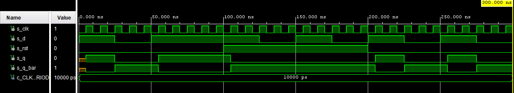

# Lab 7: Latches and Flip-flops

## 1. Preparation task

The characteristic equation of edge-triggered D-type flip-flop is:


Truth table:

| **CLK** | **D** | **Qn** | **Q(n+1)** | **Comments** |
| :-: | :-: | :-: | :-: | :-: |
| ↑ | 0 | 0 | 0 | No change |
| ↑ | 0 | 1 | 0 | Set |
| ↑ | 1 | 0 | 1 | Set |
| ↑ | 1 | 1 | 1 | No change |

The characteristic equation of edge-triggered JK-type flip-flop is:


Truth table:

| **CLK** | **J** | **K** | **Qn** | **Q(n+1)** | **Comments** |
| :-: | :-: | :-: | :-: | :-: | :-: |
| ↑ | 0 | 0 | 0 | 0 | No change |
| ↑ | 0 | 0 | 1 | 1 | No change |
| ↑ | 0 | 1 | 1 | 0 | Reset |
| ↑ | 0 | 1 | 0 | 0 | Reset |
| ↑ | 1 | 0 | 0 | 1 | Set |
| ↑ | 1 | 0 | 1 | 1 | Set |
| ↑ | 1 | 1 | 0 | 1 | Invert (Toggle) |
| ↑ | 1 | 1 | 1 | 0 | Invert (Toggle) |

The characteristic equation of edge-triggered T-type flip-flop is:


Truth table:

| **CLK** | **T** | **Qn** | **Q(n+1)** | **Comments** |
| :-: | :-: | :-: | :-: | :-: |
| ↑ | 0 | 0 | 0 | No change |
| ↑ | 0 | 1 | 1 | No change |
| ↑ | 1 | 0 | 1 | Invert (Toggle) |
| ↑ | 1 | 1 | 0 | Invert (Toggle) |

## 2. D latch (Transparent latch)

VHDL code listing of the process ```p_d_latch```:

```vhdl
p_d_latch : process(en, d, arst)
begin
    if (arst = '1') then
        q       <= '0';
        q_bar   <= '1';
    elsif (en = '1') then
        q       <= d;
        q_bar   <= not d;
    end if;
end process p_d_latch;
```
Listing of VHDL reset and stimulus processes from the testbench file ```tb_d_latch.vhd```:

```vhdl
--------------------------------------------------------------------
-- Reset generation process
--------------------------------------------------------------------
p_reset_gen : process
begin
    s_arst      <= '0';
    wait for 400 ns;
    s_arst      <= '1';
    wait for 125 ns;
    s_arst      <= '0';
    wait;
end process p_reset_gen;

--------------------------------------------------------------------
-- Data generation process
--------------------------------------------------------------------
p_stimulus : process
begin
    report "Stimulus process started" severity note;
    
    s_en        <= '0';
    s_d         <= '0';
    wait for 50 ns;
    
    -- Test data input 
    s_d         <= '1';
    wait for 25 ns;  
    s_d         <= '0';
    wait for 25 ns; 
    s_d         <= '1';
    wait for 25 ns; 
    s_d         <= '0';
    wait for 25 ns; 
    
    -- Test enable
    s_en        <= '1';
    wait for 25 ns;  
    
    s_d         <= '1';
    wait for 25 ns;
    -- Expected output
    assert ((s_q = '1') and (s_q_bar = '0'))
    -- If false, then report an error
    report "Test failed for en=1, d=1, arst=0" severity error;
    
    s_d         <= '0';
    wait for 25 ns;
    -- Expected output
    assert ((s_q = '0') and (s_q_bar = '1'))
    -- If false, then report an error
    report "Test failed for en=1, d=0, arst=0" severity error;
    
    s_d         <= '1';
    wait for 25 ns;
    -- Expected output
    assert ((s_q = '1') and (s_q_bar = '0'))
    -- If false, then report an error
    report "Test failed for en=1, d=1, arst=0" severity error;
    
    s_d         <= '0';
    wait for 25 ns;
    -- Expected output
    assert ((s_q = '0') and (s_q_bar = '1'))
    -- If false, then report an error
    report "Test failed for en=1, d=1, arst=0" severity error;
        
    s_en        <= '0';
    wait for 25 ns;
    
    s_d         <= '1';
    wait for 25 ns;
    assert ((s_q = '0') and (s_q_bar = '1'))
    -- If false, then report an error
    report "Test failed for en=0, d=1, arst=0" severity error;
    
    s_d         <= '0';
    wait for 25 ns;
    assert ((s_q = '0') and (s_q_bar = '1'))
    -- If false, then report an error
    report "Test failed for en=0, d=0, arst=0" severity error;
    
    s_d         <= '1';
    wait for 25 ns;
    assert ((s_q = '0') and (s_q_bar = '1'))
    -- If false, then report an error
    report "Test failed for en=0, d=1, arst=0" severity error;
    
    s_d         <= '0';
    wait for 25 ns;   
    assert ((s_q = '0') and (s_q_bar = '1'))
    -- If false, then report an error
    report "Test failed for en=0, d=0, arst=0" severity error;
    
    -- Test reset
    s_en        <= '1';
    wait for 25 ns;  
    
    s_d         <= '1';
    wait for 25 ns;
    -- Expected output
    assert ((s_q = '0') and (s_q_bar = '1'))
    -- If false, then report an error
    report "Test failed for en=1, d=1, arst=1" severity error;
    
    s_d         <= '0';
    wait for 25 ns;
    -- Expected output
    assert ((s_q = '0') and (s_q_bar = '1'))
    -- If false, then report an error
    report "Test failed for en=1, d=0, arst=1" severity error;
    
    s_d         <= '1';
    wait for 25 ns;
    -- Expected output
    assert ((s_q = '0') and (s_q_bar = '1'))
    -- If false, then report an error
    report "Test failed for en=1, d=1, arst=1" severity error;
    
    s_d         <= '0';
    wait for 25 ns;
    -- Expected output
    assert ((s_q = '0') and (s_q_bar = '1'))
    -- If false, then report an error
    report "Test failed for en=1, d=0, arst=1" severity error;
    
    s_en        <= '0';
    wait for 50 ns;
    
    report "Stimulus process finished" severity note;
    wait;
end process p_stimulus;
```
Simulated time waveforms:


## 3. Flip-flops

### 3.1 D-type flip-flop with an async reset

VHDL code listing of the process ```p_d_ff_arst```:

```vhdl
p_d_ff_arst : process(clk, arst)         
begin                                                                
    if (arst = '1') then                 
        q       <= '0';                  
        q_bar   <= '1';                  
    elsif rising_edge (clk) then                
        q       <= d;                    
        q_bar   <= not d;                
    end if;                                                                 
end process p_d_ff_arst;                   
```

Listing of VHDL clock, reset and stimulus processes from the testbench file ```tb_d_ff_arst```:

```vhdl
--------------------------------------------------------------------
-- Clock generation process
--------------------------------------------------------------------
p_clk_gen : process
begin
    while now < 300 ns loop         -- 30 periods of 100MHz clock
        s_clk <= '0';
        wait for c_CLK_100MHZ_PERIOD / 2;
        s_clk <= '1';
        wait for c_CLK_100MHZ_PERIOD / 2;
    end loop;
    wait;
end process p_clk_gen;

--------------------------------------------------------------------
-- Reset generation process
--------------------------------------------------------------------
p_reset_gen : process
begin
    s_arst      <= '0';
    wait for 100 ns;
    s_arst      <= '1';
    wait for 100 ns;
    s_arst      <= '0';
    wait;
end process p_reset_gen;

--------------------------------------------------------------------
-- Data generation process
--------------------------------------------------------------------
p_stimulus : process
begin
    report "Stimulus process started" severity note;
    
    -- Test data input 
    s_d         <= '1';
    wait for 25 ns;
    -- Expected output
    assert ((s_q = '1') and (s_q_bar = '0'))
    -- If false, then report an error
    report "Test failed for d=1, arst=0" severity error;
    
    s_d         <= '0';
    wait for 25 ns;
    -- Expected output
    assert ((s_q = '0') and (s_q_bar = '1'))
    -- If false, then report an error
    report "Test failed for d=0, arst=0" severity error;
    
    s_d         <= '1';
    wait for 25 ns;
    -- Expected output
    assert ((s_q = '1') and (s_q_bar = '0'))
    -- If false, then report an error
    report "Test failed for d=1, arst=0" severity error;

    -- Test reset   
    s_d         <= '1';
    wait for 25 ns;
    -- Expected output
    assert ((s_q = '0') and (s_q_bar = '1'))
    -- If false, then report an error
    report "Test failed for d=1, arst=1" severity error;
    
    s_d         <= '0';
    wait for 25 ns;
    -- Expected output
    assert ((s_q = '0') and (s_q_bar = '1'))
    -- If false, then report an error
    report "Test failed for d=0, arst=1" severity error;
    
    s_d         <= '1';
    wait for 25 ns;
    -- Expected output
    assert ((s_q = '0') and (s_q_bar = '1'))
    -- If false, then report an error
    report "Test failed for d=1, arst=1" severity error;
    
    s_d         <= '0';
    wait for 25 ns;
    -- Expected output
    assert ((s_q = '0') and (s_q_bar = '1'))
    -- If false, then report an error
    report "Test failed for d=0, arst=1" severity error;
    
    s_d         <= '1';
    wait for 25 ns;
    assert ((s_q = '1') and (s_q_bar = '0'))
    -- If false, then report an error
    report "Test failed for d=1, arst=0" severity error;
    
    s_d         <= '0';
    wait for 25 ns;
    assert ((s_q = '0') and (s_q_bar = '1'))
    -- If false, then report an error
    report "Test failed for d=0, arst=0" severity error;
    
    s_d         <= '1';
    wait for 25 ns;
    assert ((s_q = '1') and (s_q_bar = '0'))
    -- If false, then report an error
    report "Test failed for d=1, arst=0" severity error;
    
    s_d         <= '0';
    wait for 25 ns;
    assert ((s_q = '0') and (s_q_bar = '1'))
    -- If false, then report an error
    report "Test failed for d=0, arst=0" severity error;
    
    report "Stimulus process finished" severity note;
    wait;
end process p_stimulus;
```

Simulated time waveforms:


### 3.2 D-type flip-flop with a sync reset

VHDL code listing of the process ```p_d_ff_rst```:

```vhdl
p_d_ff_rst : process(clk)         
begin                                                                
    if rising_edge (clk) then
        if (rst = '1') then
            q       <= '0';
            q_bar   <= '1';
        else
            q       <= d;    
            q_bar   <= not d;
        end if; 
    end if;                                                   
end process p_d_ff_rst; 
```

Listing of VHDL clock, reset and stimulus processes from the testbench file ```tb_d_ff_rst```:

```vhdl
--------------------------------------------------------------------
-- Clock generation process
--------------------------------------------------------------------
p_clk_gen : process
begin
    while now < 300 ns loop         -- 30 periods of 100MHz clock
        s_clk <= '0';
        wait for c_CLK_100MHZ_PERIOD / 2;
        s_clk <= '1';
        wait for c_CLK_100MHZ_PERIOD / 2;
    end loop;
    wait;
end process p_clk_gen;

--------------------------------------------------------------------
-- Reset generation process
--------------------------------------------------------------------
p_reset_gen : process
begin
    s_rst      <= '0';
    wait for 100 ns;
    s_rst      <= '1';
    wait for 100 ns;
    s_rst      <= '0';
    wait;
end process p_reset_gen;

--------------------------------------------------------------------
-- Data generation process
--------------------------------------------------------------------
p_stimulus : process
begin
    report "Stimulus process started" severity note;
    
    -- Test data input 
    s_d         <= '1';
    wait for 25 ns;
    -- Expected output
    assert ((s_q = '1') and (s_q_bar = '0'))
    -- If false, then report an error
    report "Test failed for d=1, rst=0" severity error;
    
    s_d         <= '0';
    wait for 25 ns;
    -- Expected output
    assert ((s_q = '0') and (s_q_bar = '1'))
    -- If false, then report an error
    report "Test failed for d=0, rst=0" severity error;
    
    s_d         <= '1';
    wait for 50 ns;
    -- Expected output
    assert ((s_q = '1') and (s_q_bar = '0'))
    -- If false, then report an error
    report "Test failed for d=1, rst=0" severity error;

    -- Test reset   
    s_d         <= '1';
    wait for 25 ns;
    -- Expected output
    assert ((s_q = '0') and (s_q_bar = '1'))
    -- If false, then report an error
    report "Test failed for d=1, rst=1" severity error;
    
    s_d         <= '0';
    wait for 25 ns;
    -- Expected output
    assert ((s_q = '0') and (s_q_bar = '1'))
    -- If false, then report an error
    report "Test failed for d=0, rst=1" severity error;
    
    s_d         <= '1';
    wait for 25 ns;
    -- Expected output
    assert ((s_q = '0') and (s_q_bar = '1'))
    -- If false, then report an error
    report "Test failed for d=1, rst=1" severity error;
    
    s_d         <= '0';
    wait for 25 ns;
    -- Expected output
    assert ((s_q = '0') and (s_q_bar = '1'))
    -- If false, then report an error
    report "Test failed for d=0, rst=1" severity error;
    
    s_d         <= '1';
    wait for 25 ns;
    assert ((s_q = '1') and (s_q_bar = '0'))
    -- If false, then report an error
    report "Test failed for d=1, rst=0" severity error;
    
    s_d         <= '0';
    wait for 25 ns;
    assert ((s_q = '0') and (s_q_bar = '1'))
    -- If false, then report an error
    report "Test failed for d=0, rst=0" severity error;
    
    s_d         <= '1';
    wait for 25 ns;
    assert ((s_q = '1') and (s_q_bar = '0'))
    -- If false, then report an error
    report "Test failed for d=1, rst=0" severity error;
    
    s_d         <= '0';
    wait for 25 ns;
    assert ((s_q = '0') and (s_q_bar = '1'))
    -- If false, then report an error
    report "Test failed for d=0, rst=0" severity error;
    
    report "Stimulus process finished" severity note;
    wait;
end process p_stimulus;
```

Simulated time waveforms:



### 3.3 JK-type flip-flop with a sync reset

VHDL code listing of the process ```p_jk_ff_rst```:

```vhdl
p_jk_ff_rst : process(clk)
begin
    if rising_edge (clk) then
        if (rst = '1') then
            s_q         <= '0';
            s_q_bar     <= '1';
        else
            if (j = '0' and k = '0') then
                s_q      <= s_q;
                s_q_bar  <= s_q_bar;
            elsif (j = '0' and k = '1') then
                s_q      <= '0';
                s_q_bar  <= '1';
            elsif (j = '1' and k = '0') then
                s_q      <= '1';
                s_q_bar  <= '0';
            else
                s_q      <= s_q_bar;
                s_q_bar  <= s_q;
            end if;
            end if;
    end if;        
end process p_jk_ff_rst;
```

Listing of VHDL clock, reset and stimulus processes from the testbench file ```tb_jk_ff_rst```:

```vhdl
--------------------------------------------------------------------
-- Clock generation process
--------------------------------------------------------------------
p_clk_gen : process
begin
    while now < 300 ns loop         -- 30 periods of 100MHz clock
        s_clk <= '0';
        wait for c_CLK_100MHZ_PERIOD / 2;
        s_clk <= '1';
        wait for c_CLK_100MHZ_PERIOD / 2;
    end loop;
    wait;
end process p_clk_gen;

--------------------------------------------------------------------
-- Reset generation process
--------------------------------------------------------------------
p_reset_gen : process
begin
    s_rst      <= '0';
    wait for 100 ns;
    s_rst      <= '1';
    wait for 100 ns;
    s_rst      <= '0';
    wait;
end process p_reset_gen;

--------------------------------------------------------------------
-- Data generation process
--------------------------------------------------------------------
p_stimulus : process
begin
    report "Stimulus process started" severity note;
    
    -- Test data input 
    s_j <= '1'; s_k <= '0'; -- Set
    wait for 25 ns;
    -- Expected output
    assert ((s_q = '1') and (s_q_bar = '0'))
    -- If false, then report an error
    report "Test failed for j=1, k=0, rst=0" severity error;
    
    s_j <= '0'; s_k <= '1'; -- Reset
    wait for 25 ns;
    -- Expected output
    assert ((s_q = '0') and (s_q_bar = '1'))
    -- If false, then report an error
    report "Test failed for j=0, k=1, rst=0" severity error;

    s_j <= '1'; s_k <= '1'; -- Toggle
    wait for 10 ns;
    -- Expected output
    assert ((s_q = '1') and (s_q_bar = '0'))
    -- If false, then report an error
    report "Test failed for j=1, k=1, rst=0" severity error;
    
    s_j <= '0'; s_k <= '0'; -- No Change
    wait for 25 ns;
    -- Expected output
    assert ((s_q = '1') and (s_q_bar = '0'))
    -- If false, then report an error
    report "Test failed for j=0, k=0, rst=0" severity error;

    -- Test reset   
    s_j <= '0'; s_k <= '0'; -- No Change
    wait for 40 ns;
    -- Expected output
    assert ((s_q = '0') and (s_q_bar = '1'))
    -- If false, then report an error
    report "Test failed for j=0, k=0, rst=1" severity error;
    
    s_j <= '0'; s_k <= '1'; -- Reset
    wait for 25 ns;
    -- Expected output
    assert ((s_q = '0') and (s_q_bar = '1'))
    -- If false, then report an error
    report "Test failed for j=0, k=1, rst=1" severity error;
    
    s_j <= '1'; s_k <= '0'; -- Set
    wait for 25 ns;
    -- Expected output
    assert ((s_q = '0') and (s_q_bar = '1'))
    -- If false, then report an error
    report "Test failed for j=1, k=0, rst=1" severity error;
    
    s_j <= '1'; s_k <= '1'; -- Toggle
    wait for 25 ns;
    -- Expected output
    assert ((s_q = '0') and (s_q_bar = '1'))
    -- If false, then report an error
    report "Test failed for j=1, k=1, rst=1" severity error;
    
    s_j <= '1'; s_k <= '0'; -- Set
    wait for 25 ns;
    -- Expected output
    assert ((s_q = '1') and (s_q_bar = '0'))
    -- If false, then report an error
    report "Test failed for j=1, k=0, rst=0" severity error;
    
    s_j <= '1'; s_k <= '1'; -- Toggle
    wait for 10 ns;
    -- Expected output
    assert ((s_q = '0') and (s_q_bar = '1'))
    -- If false, then report an error
    report "Test failed for j=1, k=1, rst=0" severity error;
    wait for 10 ns;
    -- Expected output
    assert ((s_q = '1') and (s_q_bar = '0'))
    -- If false, then report an error
    report "Test failed for j=1, k=1, rst=0" severity error;
    wait for 30 ns;
    
    s_j <= '0'; s_k <= '1'; -- Reset
    wait for 25 ns;
    -- Expected output
    assert ((s_q = '0') and (s_q_bar = '1'))
    -- If false, then report an error
    report "Test failed for j=0, k=1, rst=0" severity error;
    
    report "Stimulus process finished" severity note;
    wait;
end process p_stimulus;
```

Simulated time waveforms:


### 3.4 T-type flip-flop with a sync reset

VHDL code listing of the process ```p_t_ff_rst```:

```vhdl
p_t_ff_rst : process(clk)
begin
    if rising_edge (clk) then
        if (rst = '1') then
            s_q         <= '0';
            s_q_bar     <= '1';
        else
            if (t = '0') then
                s_q      <= s_q;
                s_q_bar  <= s_q_bar;
            else 
                s_q      <= not s_q;
                s_q_bar  <= not s_q_bar;
            end if;
            end if;
    end if;        
end process p_t_ff_rst;
```

Listing of VHDL clock, reset and stimulus processes from the testbench file ```tb_t_ff_arst```:

```vhdl
--------------------------------------------------------------------
-- Clock generation process
--------------------------------------------------------------------
p_clk_gen : process
begin
    while now < 300 ns loop         -- 30 periods of 100MHz clock
        s_clk <= '0';
        wait for c_CLK_100MHZ_PERIOD / 2;
        s_clk <= '1';
        wait for c_CLK_100MHZ_PERIOD / 2;
    end loop;
    wait;
end process p_clk_gen;

--------------------------------------------------------------------
-- Reset generation process
--------------------------------------------------------------------
p_reset_gen : process
begin
    s_rst      <= '0';
    wait for 5 ns;
    s_rst      <= '1';
    wait for 5 ns;
    s_rst      <= '0';
    wait for 90 ns;
    s_rst      <= '1';
    wait for 100 ns;
    s_rst      <= '0';
    wait;
end process p_reset_gen;

--------------------------------------------------------------------
-- Data generation process
--------------------------------------------------------------------
p_stimulus : process
begin
    report "Stimulus process started" severity note;
    
    -- Test data input 
    s_t <= '1'; 
    wait for 20 ns;
    -- Expected output
    assert ((s_q = '1') and (s_q_bar = '0'))
    -- If false, then report an error
    report "Test failed for t=1, rst=0" severity error;

    wait for 10 ns;
    -- Expected output
    assert ((s_q = '0') and (s_q_bar = '1'))
    -- If false, then report an error
    report "Test failed for t=1, rst=0" severity error;
    wait for 50 ns;
    
    s_t <= '0'; 
    wait for 30 ns;
    -- Expected output
    assert ((s_q = '0') and (s_q_bar = '1'))
    -- If false, then report an error
    report "Test failed for t=0, rst=0" severity error;
    
    -- Test reset
    s_t <= '1'; 
    wait for 10 ns;   
    -- Expected output
    assert ((s_q = '0') and (s_q_bar = '1'))
    -- If false, then report an error
    report "Test failed for t=1, rst=1" severity error;
    
    wait for 25 ns;
    -- Expected output
    assert ((s_q = '0') and (s_q_bar = '1'))
    -- If false, then report an error
    report "Test failed for t=1, rst=1" severity error;
    
    wait for 25 ns;
    -- Expected output
    assert ((s_q = '0') and (s_q_bar = '1'))
    -- If false, then report an error
    report "Test failed for t=1, rst=1" severity error;
    
    wait for 25 ns;
    -- Expected output
    assert ((s_q = '0') and (s_q_bar = '1'))
    -- If false, then report an error
    report "Test failed for t=1, rst=1" severity error;
    
    wait for 20 ns;
    assert ((s_q = '1') and (s_q_bar = '0'))
    -- If false, then report an error
    report "Test failed for t=1, rst=0" severity error;
    
    wait for 30 ns;

    s_t <= '0'; 
    wait for 10 ns;
    -- Expected output
    assert ((s_q = '0') and (s_q_bar = '1'))
    -- If false, then report an error
    report "Test failed for t=0, rst=0" severity error;

    report "Stimulus process finished" severity note;
    wait;
end process p_stimulus;
```

Simulated time waveforms:


## 4. Shift register

Image of the shift register schematic:

