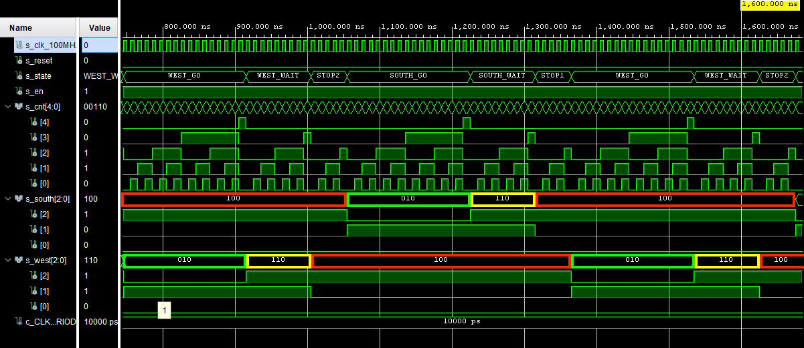

# Lab 8: Traffic light controller

## 1. Preparation task

From [Implementing a Finite State Machine in VHDL](https://www.allaboutcircuits.com/technical-articles/implementing-a-finite-state-machine-in-vhdl/):

This Finite State Machine (FSM) has four states: **A**, **B**, **C**, and **D**. The system has one input signal called **P**, and the value of **P** determines what state the system moves to next. The system changes state from **A** to **B** to **C** to **D** as long as the input **P** is *high* (1). If **P** is *low*, and the system is in state **A**, **B**, or **C**, the state is not changed. If the system is in state **D**, it changes to **B** if **P** is *high* and to **A** if **P** is *low*. The system also has an output called **R** which is 1 if in state **D**, otherwise it is a 0. 

Diagram for the FSM:


State table for the FSM:

| **Input P** | **0** | **0** | **1** | **1** | **0** | **1** | **0** | **1** | **1** | **1** | **1** | **0** | **0** | **1** | **1** | **1** |
| :- | :-: | :-: | :-: | :-: | :-: | :-: | :-: | :-: | :-: | :-: | :-: | :-: | :-: | :-: | :-: | :-: |
| **Clock** | ↑ | ↑ | ↑ | ↑ | ↑ | ↑ | ↑ | ↑ | ↑ | ↑ | ↑ | ↑ | ↑ | ↑ | ↑ | ↑ |
| **State** | A | A | B | C | C | D | A | B | C | D | B | B | B | C | D | B |
| **Output R** | 0 | 0 | 0 | 0 | 0 | 1 | 0 | 0 | 0 | 1 | 0 | 0 | 0 | 0 | 1 | 0 |  

Connection table of two of the Nexys board RGB LEDs (from [Nexys reference manual](https://reference.digilentinc.com/reference/programmable-logic/nexys-a7/reference-manual#tri-color_led)):

| **RGB LED** | **Artix-7 pin names** | **RED** | **Yellow** | **Green** |
| :-: | :-: | :-: | :-: | :-: |
| LD16 | N15, M16, R12 | 1, 0, 0 | 1, 1, 0 | 0, 1, 0 |
| LD17 | N16, R11, G14 | 1, 0, 0 | 1, 1, 0 | 0, 1, 0 |

## 2. Traffic light controller

State diagram:


Listing of VHDL code of sequential process ```p_traffic_fsm```:

```vhdl
p_traffic_fsm : process(clk)
    begin
        if rising_edge(clk) then
            if (reset = '1') then       -- Synchronous reset
                s_state <= STOP1 ;      -- Set initial state
                s_cnt   <= c_ZERO;      -- Clear all bits

            elsif (s_en = '1') then
                -- Every 250 ms, CASE checks the value of the s_state 
                -- variable and changes to the next state according 
                -- to the delay value.
                case s_state is

                    -- If the current state is STOP1, then wait 1 sec
                    -- and move to the next GO_WAIT state.
                    when STOP1 =>
                        -- Count up to c_DELAY_1SEC (1 sec)
                        if (s_cnt < c_DELAY_1SEC) then
                            s_cnt <= s_cnt + 1;
                        else
                            -- Move to the next state
                            s_state <= WEST_GO;
                            -- Reset local counter value
                            s_cnt   <= c_ZERO;
                        end if;

                    when WEST_GO =>
                       -- Count up to c_DELAY_GO (4 sec)
                        if (s_cnt < c_DELAY_GO) then
                            s_cnt <= s_cnt + 1;
                        else
                            -- Move to the next state
                            s_state <= WEST_WAIT;
                            -- Reset local counter value
                            s_cnt   <= c_ZERO;
                        end if;
                        
                    when WEST_WAIT =>
                       -- Count up to c_DELAY_WAIT (2 sec)
                        if (s_cnt < c_DELAY_WAIT) then
                            s_cnt <= s_cnt + 1;
                        else
                            -- Move to the next state
                            s_state <= STOP2;
                            -- Reset local counter value
                            s_cnt   <= c_ZERO;
                        end if;  
                               
                    when STOP2 =>
                       -- Count up to c_DELAY_1SEC (1 sec)
                        if (s_cnt < c_DELAY_1SEC) then
                            s_cnt <= s_cnt + 1;
                        else
                            -- Move to the next state
                            s_state <= SOUTH_GO;
                            -- Reset local counter value
                            s_cnt   <= c_ZERO;
                        end if; 
                        
                    when SOUTH_GO =>
                       -- Count up to c_DELAY_GO (4 sec)
                        if (s_cnt < c_DELAY_GO) then
                            s_cnt <= s_cnt + 1;
                        else
                            -- Move to the next state
                            s_state <= SOUTH_WAIT;
                            -- Reset local counter value
                            s_cnt   <= c_ZERO;
                        end if;  
                        
                    when SOUTH_WAIT =>
                       -- Count up to c_DELAY_WAIT (2 sec)
                        if (s_cnt < c_DELAY_WAIT) then
                            s_cnt <= s_cnt + 1;
                        else
                            -- Move to the next state
                            s_state <= STOP1;
                            -- Reset local counter value
                            s_cnt   <= c_ZERO;
                        end if;   
                        
                    -- It is a good programming practice to use the 
                    -- OTHERS clause, even if all CASE choices have 
                    -- been made. 
                    when others =>
                        s_state <= STOP1;

                end case;
            end if; -- Synchronous reset
        end if; -- Rising edge
    end process p_traffic_fsm;
```

Listing of VHDL code of combinatorial process ```p_output_fsm```:

```vhdl
p_output_fsm : process(s_state)
    begin
        case s_state is
            when STOP1 =>
                south_o <= "100";   -- Red (RGB = 100)
                west_o  <= "100";   -- Red
            when WEST_GO =>
                south_o <= "100";   -- Red
                west_o  <= "010";   -- Green (RGB = 010)
            when WEST_WAIT =>
                south_o <= "100";   -- Red
                west_o  <= "110";   -- Yellow (RGB = 110)
            when STOP2 =>
                south_o <= "100";   -- Red 
                west_o  <= "100";   -- Red 
            when SOUTH_GO =>
                south_o <= "010";   -- Green 
                west_o  <= "010";   -- Red 
            when SOUTH_WAIT =>
                south_o <= "110";   -- Yellow
                west_o  <= "100";   -- Red
            when others =>
                south_o <= "100";   -- Red
                west_o  <= "100";   -- Red
        end case;
    end process p_output_fsm;
```

Screenshot of the simulation (10 μs):


Screenshot of the simulation (1 full cycle) with highlighted colors:



## 3. Smart controller

According to [Traffic Light, Finite State Machine with Arduino](https://arduining.com/2015/09/18/traffic-light-states-machine-with-arduino/), inputs and outputs are:


State table:

<table>
    <thead>
        <tr>
            <th style="text-align:left" rowspan=3>Current State</th>
            <th colspan=3>Output</th>
            <th colspan=4>Next State</th>
        </tr>
        <tr>
            <th rowspan=2>Direction South</th>
            <th rowspan=2>Direction West</th>
            <th rowspan=2>Delay</th>
            <th>No Cars</th>
            <th>Cars to West</th>
            <th>Cars to South</th>
            <th>Cars Both Directions</th>
        </tr>
        <tr>
            <th><code>00</code></th>
            <th><code>01</code></th>
            <th><code>10</code></th>
            <th><code>11</code></th>
        </tr>
    </thead>
    <tbody style="text-align:center">
        <tr>
            <td style="text-align:left"><code>STOP1</code></td>
            <td>RED<br><code>100</code></td>
            <td>RED<br><code>100</code></td>
            <td>1 sec</td>
            <td><code>WEST_GO</code></td>
            <td><code>WEST_GO</code></td>
            <td><code>SOUTH_GO</code></td>
            <td><code>WEST_GO</code></td>
        </tr>
        <tr>
            <td style="text-align:left"><code>WEST_GO</code></td>
            <td>RED<br><code>100</code></td>
            <td>GREEN<br><code>010</code></td>
            <td>4 sec</td>
            <td><code>WEST_GO</code></td>
            <td><code>WEST_GO</code></td>
            <td><code>WEST_WAIT</code></td>
            <td><code>WEST_WAIT</code></td>
        </tr>
        <tr>
            <td style="text-align:left"><code>WEST_WAIT</code></td>
            <td>RED<br><code>100</code></td>
            <td>YELLOW<br><code>110</code></td>
            <td>2 sec</td>
            <td><code>SOUTH_GO</code></td>
            <td><code>SOUTH_GO</code></td>
            <td><code>SOUTH_GO</code></td>
            <td><code>SOUTH_GO</code></td>
        </tr>
        <tr>
            <td style="text-align:left"><code>STOP2</code></td>
            <td>RED<br><code>100</code></td>
            <td>RED<br><code>100</code></td>
            <td>1 sec</td>
            <td><code>SOUTH_GO</code></td>
            <td><code>WEST_GO</code></td>
            <td><code>SOUTH_GO</code></td>
            <td><code>SOUTH_GO</code></td>
        </tr>
        <tr>
            <td style="text-align:left"><code>SOUTH_GO</code></td>
            <td>GREEN<br><code>010</code></td>
            <td>RED<br><code>100</code></td>
            <td>4 sec</td>
            <td><code>SOUTH_GO</code></td>
            <td><code>SOUTH_WAIT</code></td>
            <td><code>SOUTH_GO</code></td>
            <td><code>SOUTH_WAIT</code></td>
        </tr>
        <tr>
            <td style="text-align:left"><code>SOUTH_WAIT</code></td>
            <td>YELLOW<br><code>110</code></td>
            <td>RED<br><code>100</code></td>
            <td>2 sec</td>
            <td><code>WEST_GO</code></td>
            <td><code>WEST_GO</code></td>
            <td><code>WEST_GO</code></td>
            <td><code>WEST_GO</code></td>
        </tr>
    </tbody>
</table>

State diagram:


Listing of VHDL code of sequential process ```p_smart_traffic_fsm```:

```vhdl
p_smart_traffic_fsm : process(clk)
    begin
        if rising_edge(clk) then
            if (reset = '1') then       -- Synchronous reset
                s_state <= STOP1 ;      -- Set initial state
                s_cnt   <= c_ZERO;      -- Clear all bits

            elsif (s_en = '1') then
                -- Every 250 ms, CASE checks the value of the s_state 
                -- variable and changes to the next state according 
                -- to the delay value.
                case s_state is

                    -- If the current state is STOP1, then wait 1 sec
                    -- and move to the next GO_WAIT state.
                    when STOP1 =>
                        -- Count up to c_DELAY_1SEC (1 sec)
                        if (s_cnt < c_DELAY_1SEC) then
                            s_cnt <= s_cnt + 1;
                        else
                            -- If cars in South Direction
                            if (sensor = "10") then
                                -- Skip to the SOUTH_GO state
                                s_state <= SOUTH_GO;
                                -- Reset local counter value
                                s_cnt   <= c_ZERO;
                            else
                                -- Move to the next state
                                s_state <= WEST_GO;
                                -- Reset local counter value
                                s_cnt   <= c_ZERO;
                            end if;
                        end if;

                    when WEST_GO =>
                       -- Count up to c_DELAY_GO (4 sec)
                        if (s_cnt < c_DELAY_GO) then
                            s_cnt <= s_cnt + 1;
                        else
                            -- If No Cars or cars in West Direction only
                            if (sensor = "00" or sensor = "01") then
                                -- Stay on the same state
                                s_state <= WEST_GO;
                                -- Reset local counter value
                                s_cnt   <= c_ZERO;
                            -- If cars in South Direction or Both Directions
                            elsif (sensor = "10" or sensor = "11") then
                                -- Move to the next state
                                s_state <= WEST_WAIT;
                                -- Reset local counter value
                                s_cnt   <= c_ZERO;
                            end if;
                        end if;
                        
                    when WEST_WAIT =>
                       -- Count up to c_DELAY_WAIT (2 sec)
                        if (s_cnt < c_DELAY_WAIT) then
                            s_cnt <= s_cnt + 1;
                        else
                            -- Move to the next state
                            s_state <= STOP2;
                            -- Reset local counter value
                            s_cnt   <= c_ZERO;
                        end if;  
                               
                    when STOP2 =>
                       -- Count up to c_DELAY_1SEC (1 sec)
                        if (s_cnt < c_DELAY_1SEC) then
                            s_cnt <= s_cnt + 1;
                        else
                            -- If cars in West Direction
                            if (sensor = "01") then
                                -- Skip to the WEST_GO state
                                s_state <= WEST_GO;
                                -- Reset local counter value
                                s_cnt   <= c_ZERO;
                            else
                                -- Move to the next state
                                s_state <= SOUTH_GO;
                                -- Reset local counter value
                                s_cnt   <= c_ZERO;
                            end if;
                        end if; 
                        
                    when SOUTH_GO =>
                       -- Count up to c_DELAY_GO (4 sec)
                        if (s_cnt < c_DELAY_GO) then
                            s_cnt <= s_cnt + 1;
                        else
                            -- If No Cars or cars in South Direction only
                            if (sensor = "00" or sensor = "10") then
                                -- Stay on the same state
                                s_state <= SOUTH_GO;
                                -- Reset local counter value
                                s_cnt   <= c_ZERO;
                            -- If cars in West Direction or Both Directions
                            elsif (sensor = "01" or sensor = "11") then
                                -- Move to the next state
                                s_state <= SOUTH_WAIT;
                                -- Reset local counter value
                                s_cnt   <= c_ZERO;
                            end if;
                        end if;  
                        
                    when SOUTH_WAIT =>
                       -- Count up to c_DELAY_WAIT (2 sec)
                        if (s_cnt < c_DELAY_WAIT) then
                            s_cnt <= s_cnt + 1;
                        else
                            -- Move to the next state
                            s_state <= STOP1;
                            -- Reset local counter value
                            s_cnt   <= c_ZERO;
                        end if;   
                        
                    -- It is a good programming practice to use the 
                    -- OTHERS clause, even if all CASE choices have 
                    -- been made. 
                    when others =>
                        s_state <= STOP1;

                end case;
            end if; -- Synchronous reset
        end if; -- Rising edge
    end process p_smart_traffic_fsm;
```
