# DE1-Projekt 1: Parking assistant with HC-SR04 ultrasonic sensor, sound signaling using PWM, signaling by LED bargraph.

## Team members

**Pavlo Shelemba** **-** **212579**

**Radim Pařízek** **-** **221483**

**Viliam Putz** **-** **221489**

**Pospíšil Martin - 221454**

[GitHub repozitory](https://github.com/xshele01/Digital-electronics-1/tree/main/Project/PROJECT)

## Project objectives

Project goal is to implement parking assistant with HC-SR04 ultrasonic sensor onto board Arty A7-100T. 
The system should have LED bargraph for light signaling and PWM sound for sound signaling.

Modern car has front and rear sensors, which are activated with a respective gear. Therefore, our implementation should have at least one sensor at the front of the car and at least one at the back.

## Hardware description

### Board Arty A7-100T

Arty A7-100T has all the necessary components to implement such system.

To connect ultrasonic sensors, we can use available PMOD connectors. We can use on-board switches for turning the parking system on and off and choosing gear.  On-board LEDs are ideal for bargraph. 

Unfortunately, there is no sound emitting source on the board, so we have to connect it separately. Our design proposes the use of a piezoelectric buzzer as the sound source.

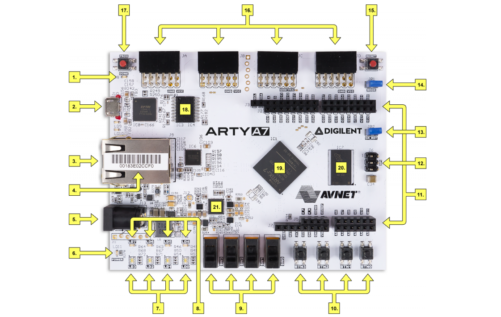

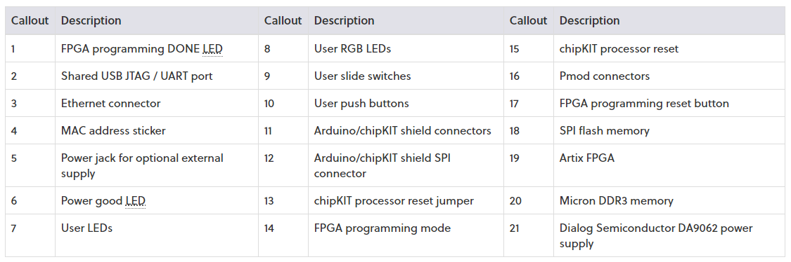

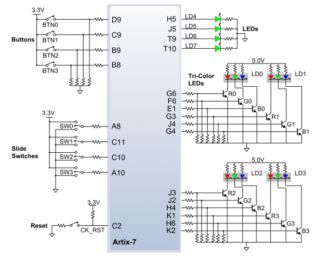

### HC-SR04 ultrasonic sensors

The input to the system is a low cost HC-SR04 ultrasonic sensor. Each sensor has 4 pins, namely  Trigger, Echo, Power and Ground. When a trigger signal of 10uS is sent to the ultrasonic sensor the sensor itself produces a set of eight burst signals through the transmitter. The receiver receives the reflected back signal and outputs a pulse proportional to the distance measured. A detailed image is shown in the timing diagram. The ultrasonic range sensor has a detection range of 4.5 m with an accuracy of 3 mm. FPGA enables us to get large amount of concurrent sensor readings without any delay.

In our implementation, we limited detection range of the sensor to 2.5 m, as there is no need to signal about an object at a larger distance while parking. 

The ultrasonic sensor works at 5V and the FPGA board works at 3.3V. A trigger signal of 3.3V is enough for the ultrasonic sensor while the echo signal output of 5V could damage the FPGA board. So a voltage divider has to be used to level shift the echo signal.

**Connection pins**

Front of the car: ```echo_i[0]``` and ```trig_o[0]```.
Back of the car: ```echo_i[1]``` and ```trig_o[1] ```.

|  HC-SR04  | BOARD - JA_PMOD |
| :-------: | :-------------: |
| echo_i[0] |     PIN A11     |
| trig_o[0] |     PIN D12     |
| echo_i[1] |     PIN A18     |
| trig_o[1] |     PIN K16     |

**Timing Diagram for HC-SR04 Ultrasonic Sensor**

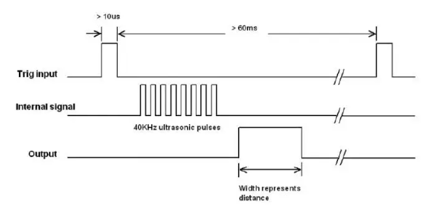


#### Used pinns

**RGB LEDs** 

| Board PIN |  LED   |
| :-------: | :----: |
|    E1     | led0_b |
|    F6     | led0_g |
|    G6     | eld0_r |
|    G4     | eld1_b |
|    J4     | led1_g |
|    G3     | led1_r |
|    H4     | led2_b |
|    J2     | led2_g |
|    J3     | led2_r |
|    K2     | led3_b |
|    H6     | led3g  |
|    K1     | led3_r |

**LEDs**

| Board PIN |  LED   |
| :-------: | :----: |
|    H5     | led[0] |
|    J5     | led[1] |
|    T9     | led[2] |
|    T10    | led[3] |

**Switches**

| Board PIN | Switch  |
| :-------: | :-----: |
|    A8     | sw_i[0] |
|    C11    | sw_i[1] |

**PWM** 

| Board JD_Pmod |  Pwm  |
| :-----------: | :---: |
|    PIN F3     | pwm_o |

### VHDL modules descriptions and simulations

#### driver_hc_sr04

Driver module uses triger and count modules to calculate distance based on the recieved echo signal:


[VHDL code of cnt_up_down](https://github.com/xshele01/Digital-electronics-1/blob/main/Labs/05-counter/counter/counter.srcs/sources_1/new/cnt_up_down.vhd)

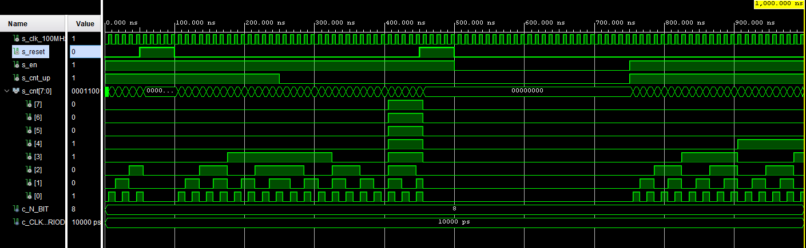

[VHDL code of trigger](https://github.com/xshele01/Digital-electronics-1/blob/main/Project/PROJECT/PROJECT.srcs/sources_1/new/trigger.vhd)

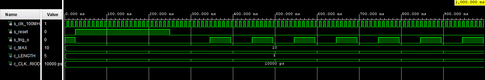

According to HC-SR04 data sheet, to get distance in centimetres we need to divide time in microseconds by 58. Given that 1 microsecond takes 100 clock periods to pass, we can divide the number of clock periods that describe echo signals’ length by 5800. Given that division should be avoided in hardware if not strictly necessary, we can replace it with multiplication with subsequent bit shifting to the right. Bit shifting to the right is essentially division by 2, so we need to somehow replace 5800 with a number, that is an order of 2. In our case, we chose 2^18, as it gives sufficient accuracy for our range.

Therefore, the resulting formula is:


As echo signal reports distance in both directions, we need to divide that number by another 2. Therefore, to get the correct distance, we multiply pulse width of an echo signal by 45 and bit shift it to the right by 19 bits.

When we want to divide by integer, we can have a more accurate result implementing a rounding, i.e. adding 0,5 to the floating point result, before performing the truncation. In VHDL (or fixed point representation) 0,5 is represented by 2^(M-1) if M is the number of bits representing the constant we want to divide to. So in our case, 2^17

[VHDL code of driver_hc_sr_04](https://github.com/xshele01/Digital-electronics-1/blob/main/Project/PROJECT/PROJECT.srcs/sources_1/new/driver_hc_sr04.vhd)

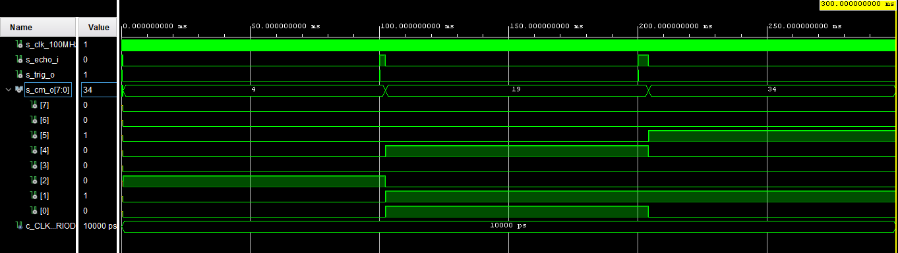

#### Bargraph

Displayes calculated distance using on-board LEDs and RGB LEDs. For close objects (less than 30 cm) red color lights up, for middle distance (from 30 to 100) - yellow, for safe distance (more than 100) - green.

[VHDL code of bargraph](https://github.com/xshele01/Digital-electronics-1/blob/main/Project/PROJECT/PROJECT.srcs/sources_1/new/driver_hc_sr04.vhd)

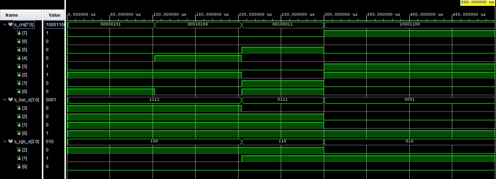

#### PWM generation

Generates pwm signal with fixed duty cycle  of 50% (max volume) and rate (pitch). Resulting pulse produces square wave at A3 note (440 Hz). Pulsing rate is set by calculated distance.

[VHDL code of pwm](https://github.com/xshele01/Digital-electronics-1/blob/main/Project/PROJECT/PROJECT.srcs/sources_1/new/pwm.vhd)

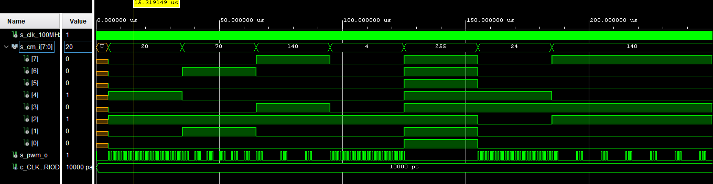

#### Switch

Implements turning parking system on and off and choosing gear. Redistributes signals from and to the corresponding inputs/outputs of the system.

[VHDL code of switch](https://github.com/xshele01/Digital-electronics-1/blob/main/Project/PROJECT/PROJECT.srcs/sources_1/new/switch.vhd)

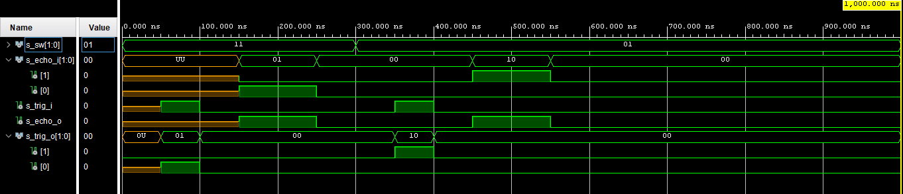

## Description of TOP module and simulation

Top module is used to implement all modules onto development board Arty A7-100T. It includes clock imput and inputs from the sensors (CLK100MHZ, sw_i[1:0] and echo_i[1:0]), sw_i[0] is for power on and off, sw[1] is used to choose the sensor. Four outputs (cm_o[7:0], pwm_o, trig_o[1:0], led[3:0] and rgb_o[2:0]). Driver and pwm is controlled by the clock. Echo_i[1:0] and sw_i[1:0] are connected to the switch. 

[VHDL code of top](https://github.com/xshele01/Digital-electronics-1/blob/main/Project/PROJECT/PROJECT.srcs/sources_1/new/top.vhd)

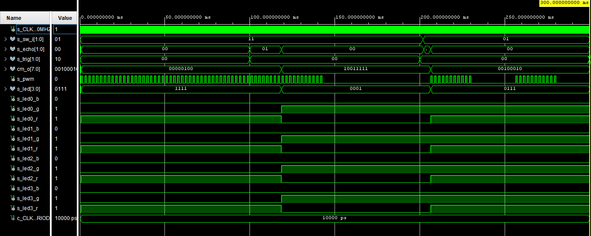

**RTL model**

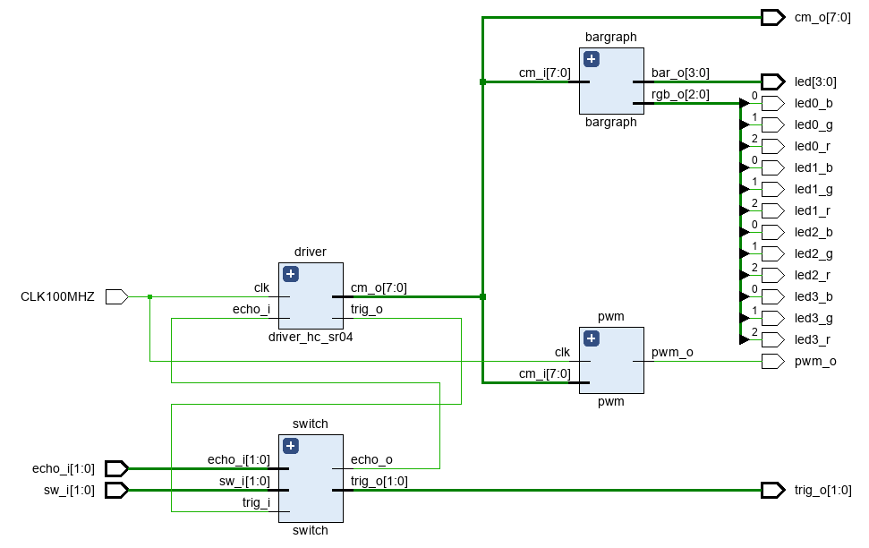

## **Video**

[Link to video](https://drive.google.com/drive/u/0/folders/1ckc2RjHWFnYiYrOzwDaQC1Dgn1szUid2)

## Discussion

Possible improovements: add temperature sensor to measure temperature dynamically and calculate velocity of sound based on it, rather than relying on a constant value of 340m.s^1.

We are also using only two sensors and they are not very accurate, esspecially at corners. In fact real parking assistants are using 4-8 senzors, possible improovement will be also increase the number of sensors.

## **References**

[Arty A7 Reference Manual]( https://reference.digilentinc.com/reference/programmable-logic/arty-a7/reference-manual)

[How HC-SR04 ultrasonic sensor works]( https://lastminuteengineers.com/arduino-sr04-ultrasonic-sensor-tutorial/)

[HC-SR04 users’ manual](https://docs.google.com/document/d/1Y-yZnNhMYy7rwhAgyL_pfa39RsB-x2qR4vP8saG73rE/edit#!)

[Parking sensor](https://en.wikipedia.org/wiki/Parking_sensor)

[Obstacle avoidance robot using FPGA VHDL]( https://www.academia.edu/29188168/Obstacle_avoidance_robot_using_FPGA_VHDL)

[How to divide an integer by constant in VHDL](https://surf-vhdl.com/how-to-divide-an-integer-by-constant-in-vhdl/)

[How to implement VHDL design for a range sensor on an FPGA](https://www.youtube.com/watch?v=PJkiDAKVTFg)

[How to create a PWM controller in VHDL](https://vhdlwhiz.com/pwm-controller/)

[Step by Step: having fun with PWM and a piezo buzzer]( https://jallib.blogspot.com/2009/02/step-by-step-having-fun-with-pwm-and_14.html)

[Digital Electronics 1 Wiki](https://github.com/tomas-fryza/Digital-electronics-1/wiki)